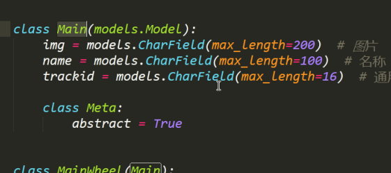
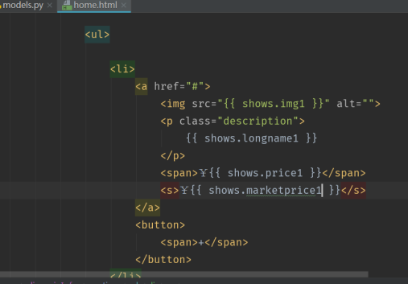
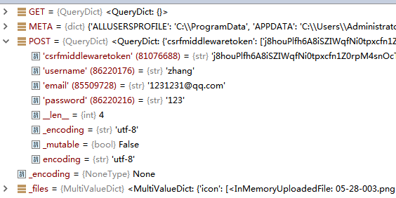

爱鲜蜂day01

---

virtualenv -p python版本的地址 --no-site-packages env

##### 首页

-   轮播图  banner
-   导航栏
-   商品展示

##### 闪购超市

-   商品分类
-   全部分类, 综合排序
-   商品展示
-   商品添加, 删除

##### 购物车

-   购物模型数据的展示
-   购物车商品数量的增删

##### 个人中心

-   待付款   待收货

-   注册
    -   上传头像, 邮箱, 账号, 密码
-   登录
-   注销  -  退出

-   abstract
-   用于继承的基本models

创建工作目录 workspace

创建环境目录  venv

