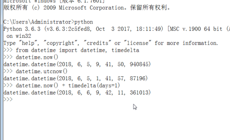
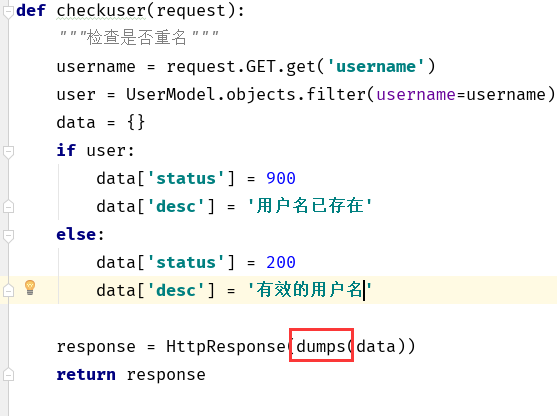
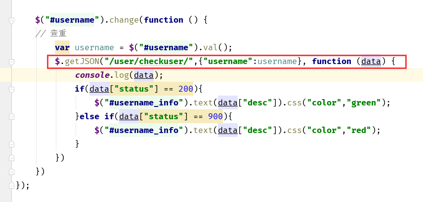
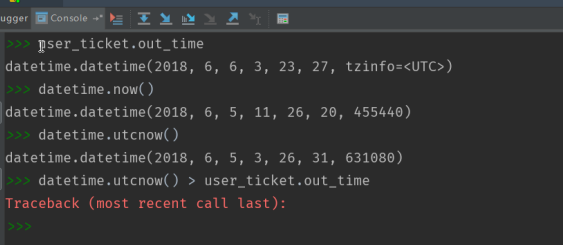
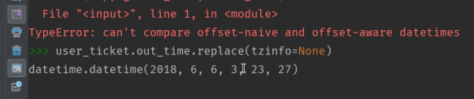
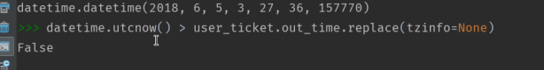
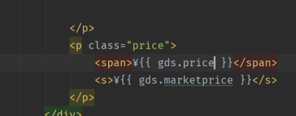
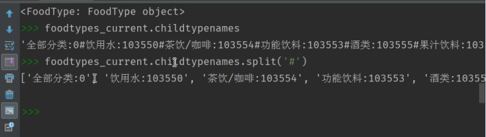
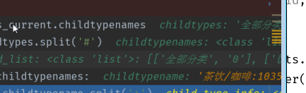
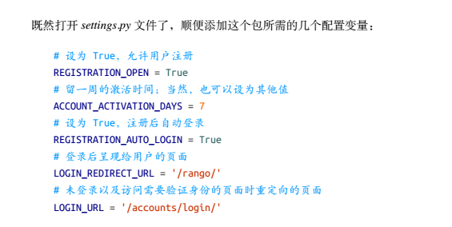

day02  登录注册  后台验证用户名密码

**代码在最后, 可以直接看代码**


---

[TOC]

---

login_url = '/login/'  登录地址


#### 登录注册


```python

data = [a, b, c]
all(data)  验证是否为空, 有一个为空会返回 False
```


-   先导入系统  -  第三方  - 自定义


debug  -  new watch  可以查找想看的东西





get_or_create()  得到的是一个==元组== tuple, 还是需要取值运算


浏览器具有保存 cookie  的特性, 根据我们设置的过期时间

中间件绑定user在请求中,  

login 时, 将 ticket 绑定在 response 中,   的cookie中, 每次请求都会带着 cookie 

中间件根据 请求中的ticket 来查找出 user,  将用户绑定在 请求中


#### HttpResponse 需要编码 dumps()  处理数据

可以直接使用  django  的`JsonResponse`

HttpResponse(dumps(data))   得到  json 格式的返回数据








#### 后台验证用户注册























### 代码

注册  登录 注销  views

```python
from json import dumps

from django.contrib.auth.hashers import make_password, check_password
from django.http import HttpResponse, HttpResponseRedirect
from django.shortcuts import render
from django.core.urlresolvers import reverse

from datetime import datetime, timedelta

from user.models import UserModel, UserTicketModel
from utils.function import create_ticket


def register(request):
    """
    注册
    """
    if request.method == 'GET':
        return render(request, 'user/user_register.html')
    if request.method == 'POST':
        username = request.POST.get('username')
        email = request.POST.get('email')
        password = request.POST.get('password')
        icon = request.FILES.get('icon')
        # 加密
        password = make_password(password)   # 加密
        if not all([username, password, icon]):
            msg = '不能为空'
            return render(request, 'user/user_register.html',
                          {'msg': msg})
        #创建用户
        user = UserModel(username=username,email=email,
                         password=password, icon=icon)
        if user:
            user.save()
        return HttpResponseRedirect(reverse('axf:mine'))


def checkuser(request):
    """检查是否重名"""
    username = request.GET.get('username')
    user = UserModel.objects.filter(username=username)
    data = {}
    if user:
        data['status'] = 900
        data['desc'] = '用户名已存在'
    else:
        data['status'] = 200
        data['desc'] = ''

    response = HttpResponse(dumps(data))
    return response


def login(request):
    """
    登录
    """
    if request.method == 'GET':
        return render(request, 'user/user_login.html')
    if request.method == 'POST':
        username = request.POST.get('username')
        password = request.POST.get('password')
        user = UserModel.objects.filter(username=username).first()
        ticket = create_ticket()
        # 将相应提取出来, 等待绑定 ticket 后返回
        resopnse = HttpResponseRedirect(reverse('axf:mine'))
        # 设置过期时间
        out_time = datetime.now() + timedelta(days=1)
        # 用户是否存在  验证密码
        if user and check_password(password, user.password):
            # 保存 ticket 得到用户, 已近存在于表中就只更新 ticket 和 过期时间
            user_t = UserTicketModel.objects.get_or_create(user_id=user.id)[0] # 得到的是个 tuple 需要取值
            # 数据库保存 用户的 ticket,out_time
            user_t.ticket = ticket
            user_t.out_time = out_time
            user_t.save()
            # 将ticket 绑定在 响应 中
            resopnse.set_cookie('ticket', ticket, expires=out_time)
            return resopnse


def logout(request):
    """
    退出登录
    """
    if request.method == 'GET':
        # 删除 cookies 中的ticket
        response = HttpResponseRedirect(reverse('axf:mine'))
        response.delete_cookie('ticket')
        # 删除 UserTicket 中的 ticket
        return response

```

#### 注册时的后台检查

```javascript
$(function () {


    $("#password_confirm").change(function () {

        var password = $("#password").val();
        var password_confirm = $(this).val();

        if (password == password_confirm){
            $("#password_confirm_info").html("两次一致").css("color","green");
        }else{
            $("#password_confirm_info").html("两次输入不一致").css("color","red");
        }
    });

    $("#username").change(function () {
    // 查重
        var username = $("#username").val();
        $.getJSON("/user/checkuser/",{"username":username}, function (data) {
            console.log(data);
            if(data["status"] == 200){
                $("#username_info").text(data["desc"]).css("color","green");
            }else if(data["status"] == 900){
                $("#username_info").text(data["desc"]).css("color","red");
            }
        })
    })
});


function check_input() {
    var color = $("#username_info").css("color");  // 验证用户名后的提示信息
    console.log(color);
    if (color == "rgb(255, 0, 0)"){
        console.log("用户名--红色的");
        return false
    }else {

        var password = $("#password").val();
        if (password.length < 1){
            console.log("密码不一致");
            return false
        }
        var password_confirm = $("#password_confirm").val();
        if (password == password_confirm){
            console.log("OK, 注册成功");
            // password = md5(password);  # 加密, 暂时不需要
            // $("#password").val(password);
            console.log(password);
            return true
        }
    }
}

```

