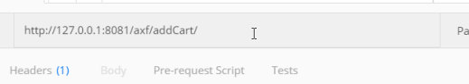
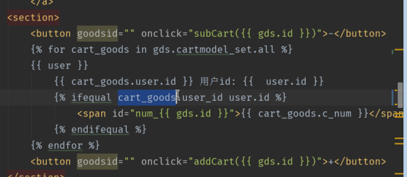
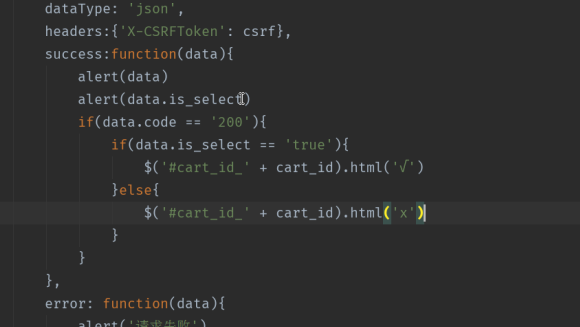
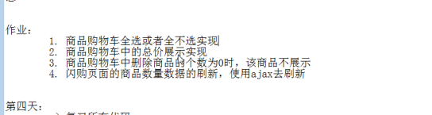

day03  添加和减少商品数量ajax请求

---

[TOC]

---

###1. postman 也可以测试 url 接口



### 2. ajax 添加和删除商品数量

#### **1. 减少商品数量代码views**

```python

def subcart(request):
    """减少 购物车"""
    if request.method == 'POST':
        user = request.user
        goods_id = request.POST.get('goods_id')
        data = {'code': 200, 'msg': '减少成功'}  # 中间的判断都是对 data 的修改, 最后返回的都是 data 

        if user.id: # 是否登录
            user_cart = CartModel.objects.filter(user=user,
                                                goods_id=goods_id).first()
            if user_cart: # 判断有没有添加该商品到购物车 数量是 0 执行 else 删除数据库中的对应的数据
                if user_cart.c_num:  # 判断商品数量
                    user_cart.c_num -= 1
                    user_cart.save()
                    data['c_num'] = user_cart.c_num
                else:  # 数量是 0 
                    user_cart.delete()  # 删除
                    data['c_num'] = 0
                    return JsonResponse(data)
            else: # 未添加到购物车
                data['c_num'] = 0
                data['msg'] = '未添加到购物车'
        else: #  用户未登录
            data['code'] = 403
            data['msg'] = '未登录'
            
        return JsonResponse(data)  #  ajax 请求 返回数据


```

#### **2. 减少商品数量的 - JS**

```javascript

function sub_cart(goods_id) {
    console.log(goods_id);
    var csrf = $('input[name="csrfmiddlewaretoken"]').val();
    $.ajax({
        url: '/axf/subcart/',
        type: 'post',
        data: {'goods_id': goods_id},
        dataType: 'json',
        headers: {'X-CSRFToken': csrf},
        success: function (data) {
            if (data.code == 200) {
                console.log(data.msg)
                $('#num_'+goods_id).text(data.c_num)
            } else {
                console.log(data.msg)
            };
        },
        error: function (data) {
            console.log('请求失败');
            console.log(data);
            console.log('请求失败');
        },

    });
};

```





```

    
        
            <span id="num_{{ gds.id }}">{{ cart_goods.c_num }}</span>
        
        	<span id="num_{{ gds.id }}">0</span>
        
    

```

```
<section>
    <button goodsid="" onclick="sub_cart({{ gds.id }})">-</button>
    <span id="num_{{ gds.id }}">0</span>
    <button goodsid="" onclick="add_cart({{ gds.id }})" >+</button>
</section>
```


````
 <span id="num_{{ gds.id }}">
       <!--判断商品是否在购物车-->
         <!--拿取所有的商品,  会有多个用户持有该商品-->
             
                     <!-- 一个商品可能在多个人的购物车中, 判断在当前用户的购物车中, 拿取该用户商品数量-->
                     
                     	{{ cart_goods.c_num }}
                     
             
         
         0
     
 </span>
````







```
o = order.ordergoodsmodel_set.first()
o.goods.productlongname
```

