day04

---

#### 调整细节

-   ​

可以用 Ajax 获取数据进行页面的渲染, 

### 部署

Debug   False

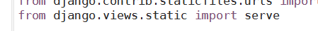

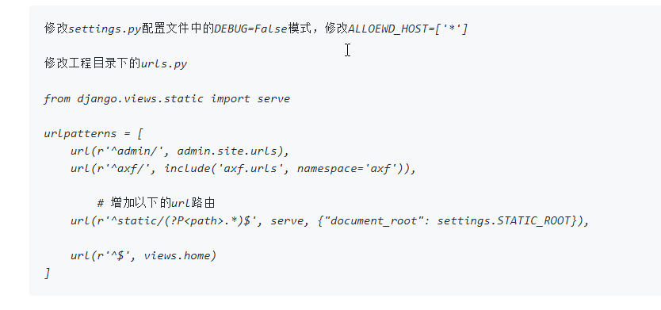

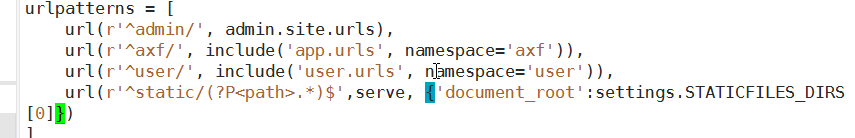

#### 目录结构

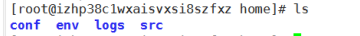

src  存放代码

conf  放置配置文件

env   环境

logs  放置日志

#### CentOS 配置

初始化服务器

#### 配置软件

-   查看 
-   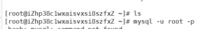

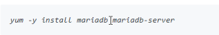

配置mysql 

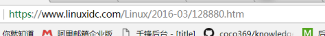

设置 mysql 

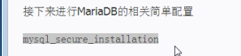

查看用户:

`SELECT DISTINCT CONCAT('User: ''',user,'''@''',host,''';') AS query FROM mysql.user;`

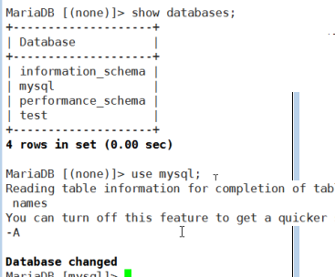

创建用户, 和密码   授权

shift  insert  插入

数据库密码, 更改为自己更改的密码

同步数据库数据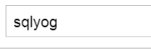

Navicat  数据传输 同步数据库

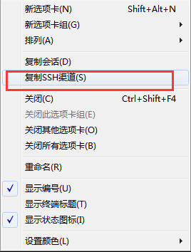

Nginx :  /etc/nginx/ 配置文件

​     /uer/share/nginx/   资源

#### Nginx 配置  conf文件

listion  端口号

server_name  可以自定义域名   ( 直接写自己的公网IP)

access_log  / 文件路径 

error_log   / 文件路径

location  / {

​	include uwsgi_parms;

​	uwsgi_pass : 127.0.0.1:8888;  uwsgi 的端口

}

location /static/ {

​	alias /home/src/axf/static/;   静态文件的目录,  超时时间可以不写

}

#### uwsgi   配置

vim uwsgi.ini

projectname = axf

base = /home/src

master = true

process = 4  进程

pythonhome = //

chdir = //

pythonpath = /usr/local/python3/bin/python3

model = %

配置完 Nginx  后重启 Nginx

tail 文件 , 将文件挂起

settings  -  debug = False

