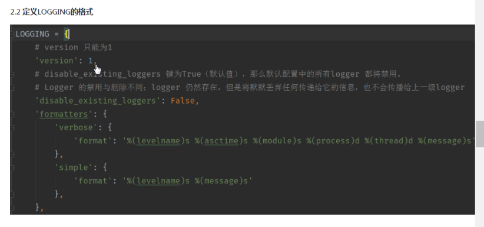

day05

---

登录   headers  加 X-sreftoken


postman 直观查看接口返回内容

模拟登陆    username password  csrf_token


### API  操作, 通过rest_framework实现

编辑

跳转编辑页面, 进行


```javascript
$(document).ready(function {
	var path = location.href   # 得到当前的url
})
```

==编辑班级==


==serializer.py==


==views.py==


==urls.py==


##### 短链接

接口返回数据, 原版

{

​	data : 数据

​	code: 返回码

​	msg : 请求信息

}


### 重构返回消息结构, 

版本-1,下一篇会总结 

- 重写JSONRender
- render_context   请求的所有信息都在里面
- utils -> functions.py    /  seeting.py注册    - serializer. update

```python

class CustomJsonRenderer(JSONRenderer):  # 定义后, 在setttings添加
    """
    返回结构重构

    {
        'data': {results},
        'code': 200,
        'msg': 提示信息,
    }
    """

    def render(self, data, accepted_media_type=None, renderer_context=None):
        if renderer_context: # 判断是否有, render, 有就重构, 没有调用父类
            if isinstance(data, dict):
                code = data.pop('code', 0)
                msg = data.pop('msg', '请求成功')
            else:   # 当不是字典时, 自动绑定参数
                code = 0
                msg = '请求成功'
            res = {
                'code': code,
                'msg': msg,
                'data': data,
            }
            return super().render(res, accepted_media_type, renderer_context)
        else:
            super().render(data, accepted_media_type, renderer_context)
            
            
# settings.py
'DEFAULT_RENDERER_CLASSES': ('utils.functions.CustomJsonRenderer',)
      
# serializer.py
def update(self, instance, validated_data):
    instance.s_name = validated_data['s_name']
    instance.save()
    data = self.to_representation(instance)

    return {'code': 300, 'msg': 'aaaa', 'data': data}

            
```


#### views.py -  update


#### serializer.py -->  do_update# 


```python
# serializer.py

def do_update(self, instance, validated_date):
    instance.s_name = validated_data['s_name']
    instance.save()
    data = self.to_representation(instance)
    
    return data

#views.py
def update(self, instance, validated_data):
    
    instance.s_name = validated_data['s_name']
    instance.save()
    data = self.to_representation(instance)
    data['code'] = code
    data['msg'] = msg
    return data
```


### 过滤 url, 获取数据


127.0.0.1:8080/app/api/student/?name=王&sex=1


views.py, 重写 viewsets.GenericViewSet  中的 get_queryset()方法

```python
def get_queryset(self):
    query = self.queryset
    
    return query.filter()
```


- 打断点看  self 里面有什么

- 到 request中的参数

- `self.request.query_params.get('s_name')`


#### 不带参数  会报错

- 最多排序 order


### 正确过滤方法

views.py  -  增加 filter_class = ''

- 安装  `pip install django_filter`

- app  -- 新建  filter.py

  `djangorestframework==3.4.6`高版本不支持  `filter`

- ==settings.py==

  - 增加配置
  - 
  - ​


app->==filter.py==


==views.py==


#### 日志

- logger
- handles   日志级别应该小于 logger
- Filters
- Formatters





apps.py:

添加 App.py

models.py

urls.py

views.py

template


4.不同模块的应用

不同的功能, 不同的模块, 需要一个单独的APP来实现, 比如用户的注销注册和登录, 需要一个单独的APP来区别


#### 快速  pip  安装包

 pip install -r xxx.txt     安装xxx.文件里面的所有的包


