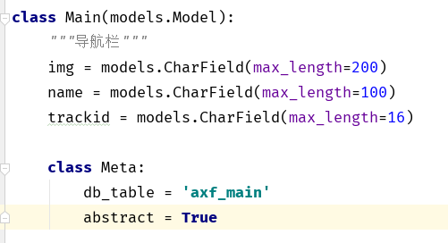
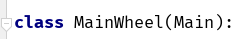
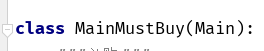

Django

---

[TOC]

---

### axf项目


#### models, 模板的继承

-   创建抽象的基类model, 用于其他相同的模型来继承
-   将 基类的 Meta属性设置为   abstract = True  
-   其它继承的 模型 就可以在 基类模板的基础上进行修改






#### 登录与注册, 关于datetime


-   在设置用户的 ticket 的过期时间时, 存储在数据库的时间, 在我们查找出来之后会自动添加一个(==tzinfo==)的属性, 要再比较时间时将其替换掉
-   在将时间存储在数据库是会自动将时间对象转化为 ==utc== 时间, 

**设置过期时间**

-   通过 datetime 模块中的 timedelta(days=1) 来设置, 也可以设置时分秒

`datetime.now() + timedelta(days=1)`将当前时间一天后


**ajax获取数据**

-   ajax发出请求, 获得的响应应该是 json 格式
-   可以使用  JsonResponse(data)   或者  HttpRespnse(dumps(data))


**用户的登录和注销**

-   登录时给用户一个随机的字符串 ticket 绑定在用户上, 可单独放在一张表中, 设置过期时间, 同时将 ticket 绑定在 response 中, 来保存在浏览器中, 通过每次 请求中的 ticket , 中间件就可以检查是否是已经登录过的用户, 来进行用户的免登陆操作, 


#### 关于商品添加减少的操作

-   通过写基础的增减和减少的 ajax-js 来进行所有的需要进行增减的地方的操作

js

```html
 <span id="num_{{ gds.id }}">
       <!--判断商品是否在购物车-->
         <!--拿取所有的商品,  会有多个用户持有该商品-->
             
                     <!-- 一个商品可能在多个人的购物车中, 判断在当前用户的购物车中, 拿取该用户商品数量-->
                     
                     	{{ cart_goods.c_num }}
                     
             
         
         0
     
 </span>
```


#### 部署上线


-   debug = False    ALLOWD_HOST = [ '*' ]

urls.py

```python
from your_project import settings
from django.views.static import serve

urlpatterns 添加一条

url(r'^static/(?P<path>.*)', serve, {'document_root': settings.STATICFILES_IDRS[0]})
```


数据库设置

nginx

uwsgi

详细在 部署中