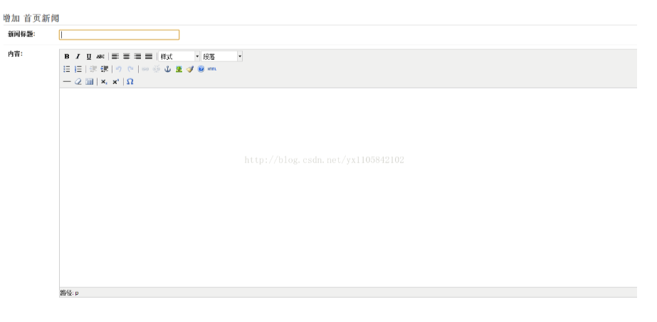

富文本编辑器 Django-tinymce

https://blog.csdn.net/u011361138/article/details/80955102

Django版本1.7，操作系统windows 7，使用`pipinstall django-tinymce`下载tinymce（前提是装的python里有pip功能），当然也可以手动下载好后python setup.py install进行安装。

 

**具体步骤：**

1.      将tinymce文件夹复制到你自己的project里面（就是你用manage.py startproject 创的那个）

2.      在project文件夹的setting里引入tinymce：在settings.py里找到INSTALLED_APPS，在里面加入’tinymce’,加入后应该是这个样子（index是我自己的app测试应用，无视）：

```python
INSTALLED_APPS = (
    'django.contrib.admin',
    'django.contrib.auth',
   'django.contrib.contenttypes',
    'django.contrib.sessions',
    'django.contrib.messages',
   'django.contrib.staticfiles',
    'index',
    'tinymce',
)

```


3. 上面两步已经将tinemce成功引入了project，那么怎么用呢？打开你自己的app，比如我的是index/models.py，使用`from tinymce.models import HTMLField`，这里HTMLField就为我们提供了一个富文本编辑器。下面给出一个模块例子：

```python
class new(models.Model):

         title = models.CharField(u'新闻标题',max_length=256)
         pub_date = models.DateTimeField(u'发表时间',auto_now_add=True, editable = True,null=True)
         content = HTMLField(u'内容',null=True)

         class Meta:
                verbose_name_plural = u'首页新闻'
                verbose_name = u'首页新闻'

         def str(self):
             return self.title

```

4.      如何配置tinymce：tinymce里默认的是最简单的样式，而且宽度和高度看起来也挺别扭的，需要我们自己配置。

打开tinymce文件，找到settings.py，打开，找到DEFAULT_CONFIG选项，这个选项是配置选项。

- 将`{'theme': "simple", 'relative_urls': False}`改成：
- `{'theme': "advanced",'relative_urls': False,’width’:’1200’,’height’:’500’}`

 

完成以上步骤，我们已经成功将TinyMCE富文本编辑器整合进了我们自己的django网站项目。以下是成果图：



 