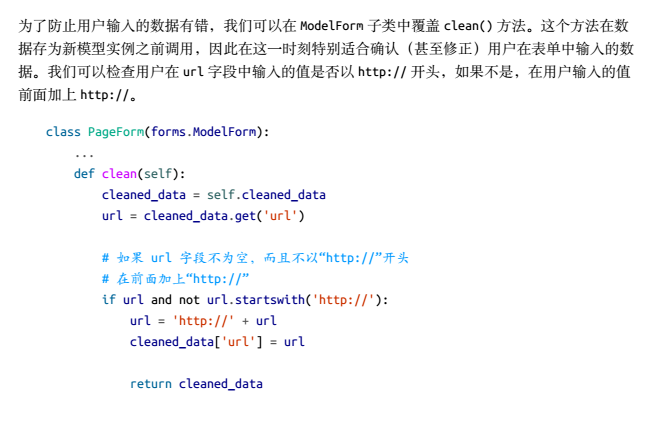

统计登录次数的函数

---

```python
def vistor_cookie_handler(requset):
    visits = int(request.COOKIES.get('visits', '1'))
    last_visit_cookie = request.COOKIES.get('last_visit', str(datetime.now()))
    last_visit_time = datetime.strptime(last_visit_cookie[:-7], '%Y-%m-%d %H:%M:%S')
    if (datetime.now() - last_vist).days > 0:
        visits += 1
        response.set_cookie('last_visit', str(datetime.now()))
    else:
        response.set_cookie('last_visit', last_visit_cookie)
    response.set_cookie('visits', visits)
        
```




