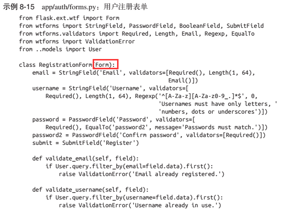
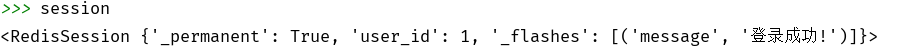

>作者: 张明禄
>
>说明: 本文主要是学习\<Flask Web开发：基于Python的Web应用开发实战>一书而写的笔记, 内容有很多的截图都是来自此书, 想要学习更多请下载官方正版进行阅读


Flask 社交博客程序 - 用户认证

---


### 用户认证

-   Flask-Login  管理用户的登录和会话
-   Werzeug  计算密码散列并进行核对
-   itsdangerous   生成并核对加密安全令牌


Flask-Mail  发送与认证相关的电子邮件

Flask-Bootstrap   HTML模板

Flask-WTF   Web 表单


#### 计算密码的散列值

使用   Werkzeug 中的security 模块,  需要下面两个函数

-   `generate_password_hash(password, method=pdkdf2:sha1, salt_length=8)`: 这个函数将原始密码作为输入, 以字符串的形式输出密码的散列值, 输出的值可保存在数据库中, method 和 salt_length的默认值能满足大多数用户的需求
-   `check_password_hash(hash, password)`: 这个函数的参数是从数据库中取回密码的散列值和用户的密码, 返回 True 表示密码正确

示例:

```python
password = generate_password_hash(password)

password_hash = user.password
check_password_hash(password_hash, password)  # True
```

也可以直接在模型中定义方法, 直接在模型中进行验证

==models.py==

```python
from werkzeug.security import generate_password_hash, check_password_hash


class User(db.Moodel):
    # ...
    password_hash = db.Column(db.String(128))
    
    # 密码应该是禁止访问的字段
    @property
    def password(self):
        raise AttributeError('password is not a readable attribute')
        
	# 存储密码       
	@password.setter
    def password(self, password):
        self.password_hash = generate_password_hash(password)
       
	# 验证密码  返回 True 表示验证通过
    def verify_password(self, password):
        return check_password_hash(self.password_hash, password)
    	
```


### 认证用户

Flask-Login  实现用户认证的方法

| 方法               | 说明                                                  |
| ------------------ | ----------------------------------------------------- |
| is_authenticated() | 如果用户已登录,返回True                               |
| is_active()        | 允许用户登录 返回 True 禁止登录 返回 False            |
| is_anonymous()     | 多普通用户返回 False()                                |
| get_id()           | 必须返回用户的唯一标志性 字段  使用 Unicode编码字符串 |

另外  还可以在定义模型时继承  ==UserMixin==来作为实现用户认证的方法,

修改User模型如下

```python
from flask_login import UserMixin

class User(User.UserMixin, db.Model):
    pass
```


`login_manager.session_protection` 表示对会话安全的保护等级

从低到高有  `None`, `basic`, `strong`


也可以调用 login_required ==限制==需要登录的==路由==

```python
from flask_login import login_required

@app.route('/admin/')
@login_required
def admin():
    return '登录后才能访问的页面'
```


#### 登录表单


页面判断用户是否登录


使用 is_authenticated()  True 表示验证通过


用户登录

```python
from flask_login import login_user
```


退出登录:


用户注册 Form   依旧使用的是  falsk_wtf 中的 Form 快速实现



wtf在实现快速登录的同时还可以 指定 正则匹配, 还可以使用 EqualTo来验证两次输入的密码是否一致

-   EqualTo 需要附属到两个密码的其中一个中, 另外一个作为参数传入

wtf.quick_form() 可以实现快速渲染表单

==注册新用户路由==

```python
@auth.route('/register/', methods=['GET', 'POST'])
def register():
	form = RegistrationForm()
    if form.validate_on_submit():
        user = User(email=form.emial.data,
                   username=form.username.data,
                   password=form.password.data)
        db.session.add(user)
        flash('You can now login')
        return '跳转页面'
```

#### falsh()  在session 中添加信息



### 使用 itsdangerous生成确认令牌

```python
from manage import app
from itsdangerous import TimedJSONWebSignatureSerializer as Serializer

s = Serializer(app.config['SECRET_KEY'], expires_time=3600)
token = s.dumps({'confirm':23})
data = s.loads(token)

```

可以生成有过期时间的令牌


### 登录后发送确认邮件


```python
from flask_login import current_user

@auth.route('/confirm/<token>/')
@login_required
def confirm(token):
	if current_user.confirmd:  # 已近确认过用户
        return redirect('成功后的页面')
    if current_user.confirm(token): 为确认
        flash('You yave confirm you account')
    else:
    	falsh('confirm invalid or has expired')        
    return redirect(url_for('main.index'))
```


### 针对全局的请求钩子 before_app_request


