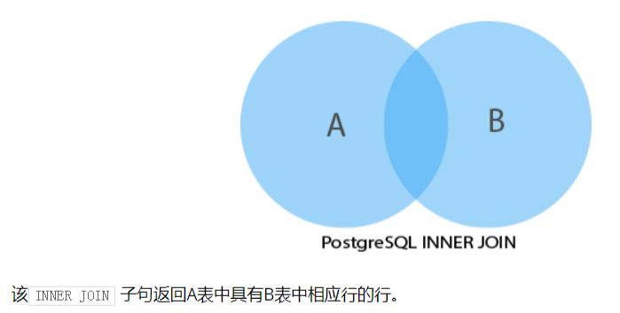
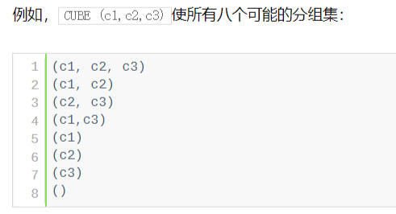
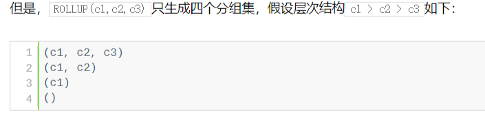

PostgreSQL

**FETCH**

```sql
-- 只获取第一条
select film_id, title from film order by title fetch first only;

select film_id, title from film order by title fetch first row only;
select film_id, title from film order by title fetch first 5 row only;  -- 获取前五条
-- 获取前五之后的五条数据
seletc film_id, title from film order by title offset 5 rows fetch first 5 row only;
```

  **IN  =  <>(不等于)  OR  AND  NOT IN范围运算符**

```sql
select customer_id, rental_id from rental 
where cuntumer_id in (1, 2) 
order by customer_id DESC;

select customer_id,rental_id from rental 
where cunstomer_id=1 or cuntomer_id=2
order by cuntomer_id DESC;

select cuntomer_id,rental_id from rental
where cuntomer_id NOT IN (1,2);
```


**带 IN 的子查询**

```sql
select cuntomer_id from rental
where case(return_date as DATE) = '2005-05-27'

select first_name, last_name from customer
where customer_id IN (
	select customer_id from rental 
    where case(return_date as DATE)='2005-05-27'
);
```


**BETWEEN 和一系列值进行匹配**

```sql
-- 选金额介于 8 和 9 之间
select customer_id,payment_id, amount from payment
where amount BETWEEN 8 AND 9;

-- 选择不在 8 和 9 之间的
select customer_id, payment_id, amount from payment
where amount NOT BETWEEN 8 AND 9;

select customer_id,payment_id,amount from payment 
where payment_date between '2007-02-07' and '2007-02-15';
```


**LIKE**

- `%`多个占位符，`_`单个占位符
- ILIKE 忽略大小写

```sql
select first_name, last_name from customer
where first_name like '%er';

select first_name, last_name form customer
where first_name likt '_her';
```


**ALIAS**  给表创建简短的别名

```sql
select a_very_long_table_name.column_name
from a_very_long_table_name;
-- 简写
select t.column_name 
from a_very_long_table_name t;  -- 或者  as t   as 可以省略

select table_name1.column_name, table_name2.column_name from table_name1 
inner join table_name2 on join_predicate;
-- 简写
select t1.column_name, t2.column_name from table_name1 t1
inner join table_name2 t2 on join_predicate;

-- 自关联
select column_list from table_name table_alias
inner join table_name on join join_predicate;
```


**INNER JOIN**



```sql
还有 
LEFT JOIN 
RIGHT JOIN
用法基本和 mysql 相同
```


**SELF JOIN** 自连接

```sql
select column_list from A a1
inner join B b1 on join_predicate;
```


**FULL OUTER JOIN**

- 完整的组合了左连接和右连接的结果，如果表中的行不匹配，则完整外部链接将为缺少的行内的空列=补充NULL
- http://www.postgresqltutorial.com/postgresql-full-outer-join/

```sql
SELECT * FROM A 
FULL [OUTER] JOIN B ON A.id=B.id;
```


**CROSS JOIN**  交叉加入

- http://www.postgresqltutorial.com/postgresql-cross-join/

```sql
select * from T1
cross join T2；
-- 和下面这句等价
select * from T1, T2;

select * from T1 INNER JOIN T2 ON TRUE;
```


**NATURE JOIN**  自然加入

```sql
SELECT * FROM T1
NATURE [INNER, LEFT, RIGHT] JOIN T2;  -- 默认是 inner join, 也可以使用 * 
```

使用 `*`  将

- 获取所有的公共列，即两表具有相同的名称的列
- 第一个和第二个表中的每列不是公共列

**GROUP BY**  和 **COUNT** 聚合函数

```sql
SELECT staff_id, COUNT(payment_id) 
from payment group by staff_id;
```


**HAVING**

```sql
select colum_1, aggregatr_function(column_2) from tb1_name
groupy by column_1 having condition;

-- 例
select store_id, count(customer_id) from customer
group by store_id having count(customer_id)>300;
```


**UNION** 

- 组合两个表的数据
- `UNION ALL` 将两个表的数据组合起来，单个 UNION 会删除一个重复(行内的所右值都相同)的行，而UNION ALL 会获取包含重复的多有行

```sql
-- 将两张表结合起来
select * from sales2017 UNION select * from sales2018;

-- 获取所有
select * from sales2017 UNION select * from sales2018;

-- 结合 ORDER BY
select * from sales2017 union all select * from sales2018
order by name ASC, amount DESC;
```


**INTERSECT**

- 将两个或多个查询的结果合并到一个结果集当中，必须 select 的字段要一致

```sql
select column_list from A intersect
select column_list from B;

-- 例： 查找即在 keys 表中的 id 也在 goods 表的中的 id

select id from keys  intersect
select id from goods order by id DESC;
```

**EXCEPT**

- 返回第一个查询中未出现在第二个查询中的行

```sql
select
```

**CUBE**

- 产生多重分组集， GROUP BY 的子条款



**ROLLUP**




**ANY**

- `=ANY`等同于`IN`
- `<>ANY` 等同于 `NOT IN`

**ALL**

- 全部满足条件，如：  大于 就要大于 条件中的每一个

**EXISTS**

- 如下， 对 customer 表中的每个客户，子查询检查payment 表查找到该客户是否至少进行了一次付款且金额大于11

  

```sql
select first_name, last_name from customer c
where exists(
	select 1 from payment p where p.customer_id = c.customer_id and amount > 11
) order by first_name,, last_name;

-- 如果 exists(select null) 那么将返回 customer 中的所有的行
```


**INSERT** 插入数据

- upsert http://www.postgresqltutorial.com/postgresql-upsert/

```sql
insert into table (column1, column2, ...) values
(v1, v2, ...);

-- 多行
insert into table (column1, column2, ...) values
(v1, v2, ...),
(v1, v2, ...);
-- 插入查的的结果
insert into table (column1, column2, ...) select 
column1, column2 from another_table where condition;

-- 插入数据并对原数据进行更该  on conflict target action
insert into customers (name, email) values
('name1', 'values1') 
on conflict on constraint customers_name_key DO NOTHING;

-- 等价于上一句
insert into customers (name, email) values ('v1', 'v2')
on conflict (name) do update set email=EXCLUDED.email ||';'||customers.email
```


**UPDATE** 更新数据

```sql
-- 创建信列并更新数据
UPDATE link_temp 
set rel=link.rel,
description = link.description,
from link where link_temp.id=link.id

-- 获取数据并进行计算将计算结果添加到新列
update product set net_price = price - price * discount
from product_segment where product.segment_id = product_segment.id
```


**DELETE**  删除操作

```sql
delete from table where condition;
-- 检查引用另外一个表中的一个或多个列的条件，使用 using
delete from table1
from another_table where table1.id=another_table.id AND ...
-- 也可以
delete from table where table.id=(select id from another_table);
```


