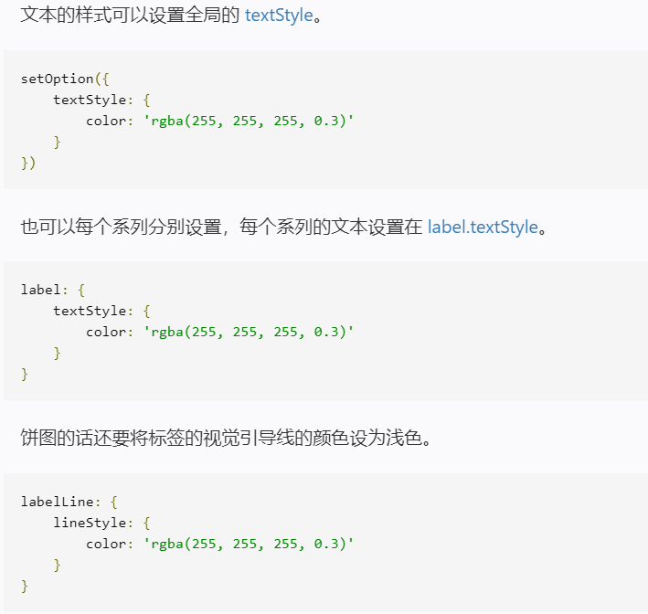
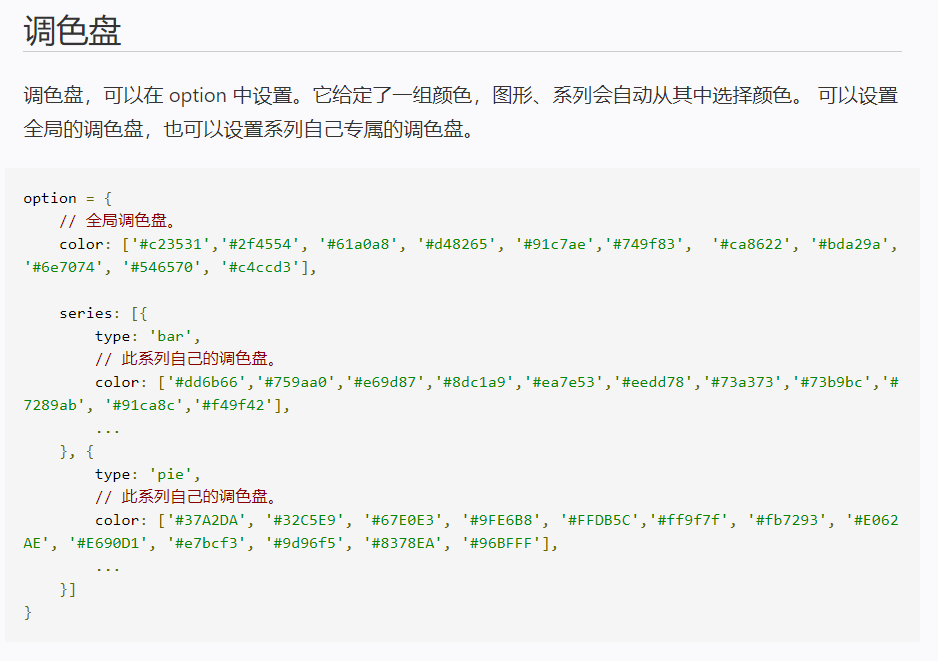
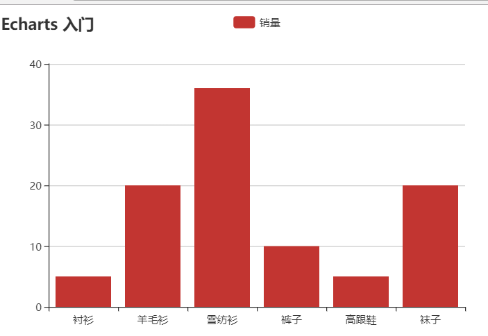

### Echarts的使用

具体的使用方法官网有很详细的文档，这里就不再多说了，这里只是简单的总结一些参数的用法 

[官方文档](http://echarts.baidu.com/tutorial.html#%E4%B8%AA%E6%80%A7%E5%8C%96%E5%9B%BE%E8%A1%A8%E7%9A%84%E6%A0%B7%E5%BC%8F)

##### [饼图 南丁格尔图](http://echarts.baidu.com/tutorial.html#%E4%B8%AA%E6%80%A7%E5%8C%96%E5%9B%BE%E8%A1%A8%E7%9A%84%E6%A0%B7%E5%BC%8F)

##### [Ajax异步加载数据](http://echarts.baidu.com/tutorial.html#%E5%BC%82%E6%AD%A5%E6%95%B0%E6%8D%AE%E5%8A%A0%E8%BD%BD%E5%92%8C%E6%9B%B4%E6%96%B0)

### 使用流程

1. 定义页面放置图形的容器
2. 引入`ecahrts.min.js`
3. 初始化echarts实例
   - `var myChart = echarts.init(document.gentElementById("main"))`
   - 这里可以选择主题light/dark，`ecarts.init(dom, 'light')`
4. 指定图表的各项参数配置和数据
   - `option = {}`
5. 给初始化的 echarts 实例指定各项参数和数据，可以调用已经定义好的 option 也可以自定义添加， 全局参数设置
   - `myChart.setOption(option)`
   - `myChart.setOption({'backgroundColor': '#2c343c'})`

### option 中的参数介绍：

图形的样式：series -> type

- 柱状图： bar
- 饼图： pie
  - radius 半径
  - roseType : 'angle' 设置为南丁格尔图
- 散点图： scatter
- 线型图： line

图表的标题 title

- `title: {text: '标题'}`

图例 legend

- `legend: {data: ["图例1"]}`

X轴的标签 xAxis，y轴 yAxis

- `xAxis: {data: ['标签1'， '标签2' ...]}`

单个图标的设置： series

- name: 名称
- type：种类
- data: 数据
  - value 值
  - name 名称
- itemStyle 设置其他属性，如：阴影- shadowBlur  shadowColor



### 其他参数设置



#### 绘制见简单的柱状图

```html
<!DOCTYPE html>
<html>
	<head>
		<meta charset="UTF-8">
		<title>Ecahrt</title>
		<script src="js/echarts.min.js"></script>
	</head>
	<body>
		<div id="main" style="width: 600px; height: 400px;"></div>
		
		<script type="text/javascript">
			var myChart = echarts.init(document.getElementById('main'))
			var option = {
				title: {
					text: 'Echarts 入门'
				},
				tooltip: {},
				legend: {
					data: ["销量"]
				},
				xAxis: {
					data: ["衬衫","羊毛衫","雪纺衫","裤子","高跟鞋","袜子"]
				},
				yAxis: {},
				series: [{
					name: '销量',
					type: 'bar',
					data: [5, 20, 36, 10, 5, 20]
				}]
			};
			
			// 使用刚制定的配置显示图标数据
			myChart.setOption(option)
			
		</script>
        
		
	</body>
</html>

```



