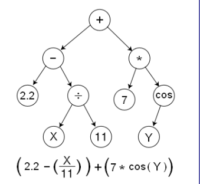
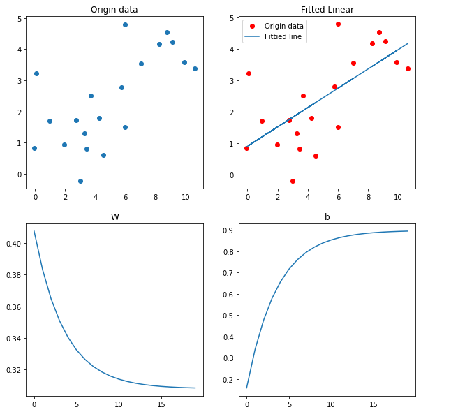

### TensorFlow

-  Tensor（张量）， 意味着N维数组，Flow（流）意味着基于数据流图的计算，TensorFlow即为张量从图的一端流动到另一端
- 支持CNN（卷积神经网络）、RNN（循环神经网络）和LSTM（长短期记忆网络）算法，是目前在 Image,NLP最流行的深度学习神经网络模型


##### 对比传统深度学习，为什么使用TensorFlow

- 深度学习意味着建立具有很多层的大规模神经网络
- 除了输入 X，函数还使用一系列的参数，其中包括标量值、向量以及最昂贵的矩阵和高级张量
- 在训练网络之前，需要定义一个代价函数，常见的代价函数包括回归问题的方差以及分类时候的交叉熵
- 训练时，需要连续将多批新输入投入网络，对所有的参数求导后，代入代价函数，从而更新整个网络模型
- 这个过程中有两个主要问题：
  1. 较大的数字或者张量在一起相乘百万次的处理使整个模型代价非常大
  2. 手动求导耗时非常久

所以，TensorFlow 的对函数的自动求导和分布式计算，可以帮助我们节省很多时间。


#### TensorFlow优点

1. 基于Python，写的很快并且具有高可读性
2. 在多GPU系统上运行更为顺畅
3. 代码编译效率较高
4. 社区发展非常迅速并且很活跃
5. 能够生成显示网络拓扑结构和性能的可视化图


#### 原理

- TensorFlow是用数据流图（data flow graphs）技术来进行数值计算的
- 数据流图是描述有向图中数值计算过程
- 有向图中，节点通常代表数学运算，边表示节点之间的某种联系，它负责传输多为数据（Tensors）
- 节点可以被分配到多个计算设备上，可以异步合并地执行操作。因为是有向图，所以只有等到之前的节点们的计算状态完成后，当前节点才能执行操作



#### 使用

- 使用（graph）来表示任务
- 在被称为回话（Session）的上下文（context）中执行图
- 使用 tensor 表示数据
- 通过变量（Variable） 维护状态
- 使用 feed 和 fetch 可以为任意操作（arbitray operation）赋值或者从中获取数据


实例：hello TensorFlow

```python

import tensorflow as tf

# 定义常量
hello = tf.constant("Hello TensorFlow")
#  使用tf创建会话
sess = tf.Session()
# 运行
print(sess.run(hello))
# 关闭会话
sess.close()

```


#### TensorFlow 模拟进行线性回归

```python

import numpy as np 
import tensorflow as tf
import matplotlib.pyplot as plt

rng = np.random

# 参数设定
learning_rate = 0.01
training_ecochs = 1000
display_step = 50

# 生成训练数据
train_X = np.linspace(0,10, num=20) + np.random.randn(20)
train_Y = np.linspace(1,4, num=20) + np.random.randn(20)
n_samples = train_X.shape[0]
# 查看数据的关系， 线性关系
plt.scatter(train_X, train_Y)
plt.title("Origin data")

# 定义 tensorflow 参数， 
# 输入
X = tf.placeholder("float")
Y = tf.placeholder("float")
# 定义变量参数，斜率和截距
W = tf.Variable(rng.randn(), name="weight")
b = tf.Variable(rng.randn(), name="bias")

# 创建线性模型
y_pred = tf.add(tf.multiply(X, W), b)

# 创建TensorFlow均方误差 cost,以及梯度下降优化器 optimizer
# 均方误差,平局误差， 比较真实数据和预测数据的差距， 以求和的方式来降低维度
cost = tf.reduce_sum(tf.pow(y_pred - Y, 2)) / n_samples

# 梯度下降，每次下降learning_rate,寻找最小的均方误差
optimizer = tf.train.GradientDescentOptimizer(learning_rate=learning_rate).minimize(cost)

# tensorflow 初始化
init = tf.global_variables_initializer()
# 训练开始
with tf.Session() as sess:
    sess.run(init)
    w_list = []
    b_list = []
    # 训练所有数据, 1000次
    for epoch in range(training_ecochs):
        for (x, y) in zip(train_X, train_Y):
            sess.run(optimizer, feed_dict={X:x, Y:y})
            
        # 每执行 50 次显示结果
        if (epoch + 1) % display_step == 0:
            c = sess.run(cost, feed_dict={X: train_X, Y: train_Y})
            w_ = sess.run(W)
            b_ = sess.run(b)
            w_list.append(w_)
            b_list.append(b_)
            print("Epoch: %04d" % (epoch + 1), "cost={:.9f}".format(c),
                 "W=", w_, "b=", b_)
    
    print("执行结束！")
    training_cost =sess.run(cost, feed_dict={X: train_X, Y:train_Y})
    print("结果： cost=", training_cost, "W=", sess.run(W), "b=", sess.run(b), '\n')
    
    # 可视化
    plt.figure(figsize=(5,15))
    plt.subplot(311)
    plt.plot(train_X, train_Y, 'ro', label="Origin data")
    plt.plot(train_X, sess.run(W)*train_X+sess.run(b), label="Fittied line")
    plt.legend()
    plt.title("Fitted Linear")
    
    plt.subplot(312)
    plt.plot(w_list)
    plt.title("W")
    
    plt.subplot(313)
    plt.plot(b_list)
    plt.title("b")
    
```

