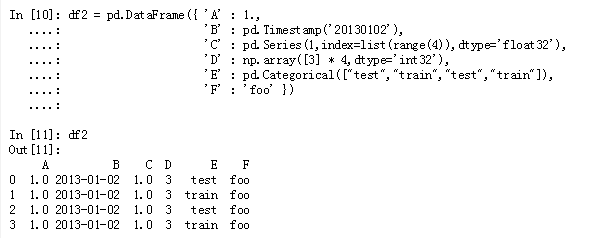

### Pandas

#### pandas适合许多不同类型的数据：

-   具有分均匀类型列的表格数据， 如在SQL表或Excel中
-   有序和无序（不一定是固定频率）时间序列数据
-   带有行和列标签的任意矩阵数据（均匀类型或异质）
-   任何其他形式的观测/统计数据集。数据实际上不需要被标记就可以放置在Pandas数据结构当中


#### Series和DataFrame

pandas的两个主要数据结构Series（一维）和DataFrame(二维)处理了金融、统计、社会中的绝大多数数据科学，以及许多工程领域


#### pandas的强大功能

*   轻松处理浮点数据中的**缺失数据**（表示为NaN）以及非浮点数据
*   大小可变性：列可以从DataFrame和更高维度的对象中**插入和删除**
*   自动和显式**数据对齐**：对象可以显式地对齐到一组标签，或者用户可以简单地忽略标签，让Series，DataFrame 等在计算中为您自动对齐数据
*   功能强大，灵活的**分组**功能对数据集执行拆分应用组合操作，以聚合和转换数据
*   使**易于将其他Python和NumPy数据结构中的**粗糙，不同索引的数据转换为DataFrame对象
*   基于智能标签的**切片**，**花式索引**和**子集化**大数据集
*   直观的**合并**和**连接**数据集
*   灵活的**重塑**和数据集的旋转
*   **轴的分层**标签（每个标记可能有多个标签）
*   用于从**平面文件**（CSV和定界），Excel文件，数据库加载数据并保存/加载超快速**HDF5格式的数据的强大IO工具**
*   **时间序列** - 特定功能：日期范围生成和频率转换，移动窗口统计，移动窗口线性回归，日期移动和滞后等。


#### 处理数据通常分为多个阶段：

-   清理和清理数据
-   分析/建模
-   将分析的结果组织成适合于绘图或表格显示的形式


pandas是处理所有这些任务的理想工具。


### 创建 DataFrame


-   可以传入一个字典来创建， 但是 行索引会自动用整数来填充



std 标准差


```python

axis=0 按行的索引排序，1 按列的索引排序
df.sort_index(axis=1, ascending=True) # ascending False 倒序

df.sort_values(by="b")   # 按某列的值进行 小 到大排序

df.T # 转置， 行和列交换

df.describe()  #得到count	mean std min 25% 50% 75% max	

在DataFrame描述中只包含字符串列。
>>> df.describe(include=[np.object])

从DataFrame描述中排除对象列。
>>> df.describe(exclude=[np.object])

从DataFrame描述中排除数字列。
>>> df.describe(exclude=[np.number])
```


```python

df.describe()  #得到count	mean std min 25% 50% 75% max	

# shift()
s = pd.Series([1, 2, 3, 4, np.nan, 7],
             index=dates).shift(2) # shift 跳过


df.apply(np.cumsum) # np.cumsum 下一列是对上一列的累加， NaN 直接跳过
```


DataFrame 列索引， 行切片

````python

DataFrame()

````


DataFrame赋值

```python

# 多级列索引的赋值
df.loc["index", ("column1", "column2")] = 200  
```


