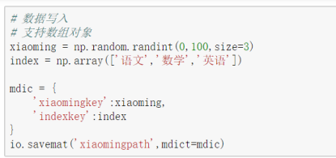
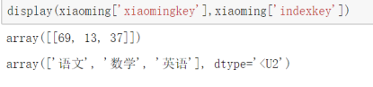

Scipy


#### 阿里镜像安装Scipy

`pip install scipy -i https://mirrors.aliyun.com/pypi/simple/`


##### [深入浅出讲解傅里叶变换](https://www.cnblogs.com/h2zZhou/p/8405717.html)


#### 微积分

`form scipy.integrate import quad`

```python
# 传入， 积分的函数， 积分的上下边界
quad(f, a, b)
```


### 文件的输入输出

-  处理文本 ` import scipy.io as io`
-  处理图片  `import scipy.misc as misc`
-  把数据存储为 二进制的格式的数据 `io.savemat()`
-  读取二进制的数据文件  `io.loadmat()`


#### 处理文本 io

-   字典存储数据，二进制格式， 不需要指定文件的文件名，自动保存为 `.mat`



-   读取二进制文件

```python
xiaoming = io.loadmat("xiaomingpath.mat")
display(xiaoming["xiaomingkey"], xiaoming["indexkey"])
```




#### 处理图片 misc

-   misc 目前的所有功能都可以被其他的库替代

```python
misc.imread()  # 读取  已经迁移到 from imageio import imread 中
misc.imsave()  # 保存   迁移到 imageio.imwrite
misc.imfilter()  # 添加过滤  迁移到 pillow 中
misc.imresize()  # 调整大小 int float tuple from skimage.transform import resize
misc.imrotate()  # 旋转
    不改变原始图片的形状
misc.imshow()  # 展示
```


#### ndimage 处理图片

-   ndimage.rotate()  旋转，会修改图片的形状
-   ndimage.zoom()  缩放
-   ndimage.shift()  移动
-   ndimage.gaussian_flter()  高斯滤波
-   ndimage.median_filter()  中值滤波


from scipy.signal import wiener   维纳滤波

wiener()  维纳滤波


jpg  uint8

png  float32

0 黑  255 白


一般对图片的异常噪声进行填充，选择为

-   平局值    受异常数据影响大
-   中位数   对异常不敏感
-   众数   可能会不存在，可以是非数值类型
-   如果都不合适，那就删除 drop


