## DataFrame

[TOC]

列索引

`df["column_name"]  df.column`

- 可以用类似字典的方式进行索引， 得到的是一个Series 对象
- 列就相当于DataFrame 的属性， DataFrame 是统计数据时的表格， 某个属性就对应一个DataFrame 的列
- 列 无法进行切片，但是不会出错，还是在行里面进行切片，所以返回的值是空的


行索引

-   `.loc[]  .iloc[]`  
-   行的检索返回值也是一个 Series 
-   检索多行  `df.loc[["A", "B"]]` 得到  DataFrame
-   loc 切片  前闭后闭
-   隐式索引 `.iloc[]`  左闭右开

有时无法检索汉字索引， 有个别字无法检索


定位索引，赋值

-   `df["column"]["index"] = '赋值'`

检索行是可以多个参数， 但是列索引使不行的

-   `df.loc["index", "column"]`

values 取值

-   `df.values[0,3]`


-   索引使行列索引
-   切片是行切片


### 运算

DataFrame 之间的运算, 自动对齐对应的数字， 没有补充 NaN

-   `df1 + df2`  对应的数据相加， 空值会出现 NaN，避免出现NaN
-   `df1.add(df2, fill_value=0)` 对 df2 中的空值 NaN, 填充 0
-   `pd.add（）` 效果相同

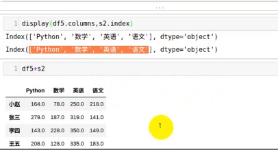


#### Pandas 的聚合函数

-   要指定 axis 轴
-   `df1.add(data, axis=["columns","index", 0, 1])`


### 数据丢失处理

-   None  NoneType 类型
-   np.nan(NaN)  浮点型

数据类型不同，运算时间也不同

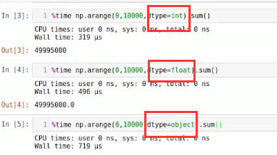


数据清洗， 处理空值

`isnull() notnull() dropna()`

-   `df=DataFrame(...)`
-   `df.isnull()` 得到是空值的地方为 True
-   any()  有一个为 True 则为 True， 在不指定 axis 的情况下，首先检查的是列
-   `s1= df.isnull().any(axis=1)`
-   `df[s1]` 得到空值的列
-   `all() `所有为 True 才是True

删除和填充空值

-   `dropna()` 默认删除为空值的行， axis =1 删除的是列
    -   `df.dropna()` 删除有空值的行， how=“all"  全部是空才删除
-   `fillna(value=0)` 指定值来填充空数据
    -   `df.fillna(method="bfill ffill")` `backfill=bfill  pad=ffill,` 取前面或者后面的值来填充空值， 默认是列的方向
    -   `df.fillna(method="fill", inpalce=True)`  对原来的对象进行修改，不产生新的对象


#### 傅里叶变换, 进行图像轮廓突出显示

摄像头捕获画面的轮廓进行识别， 通过图像中的数据变化剧烈程度

傅里叶变换：将时域装化为频域

```python

# 导入傅里叶变换， ifft 傅里叶反转
from numpy.fft import fft, ifft
from PIL import Image


cat = Image.open("cat.png")
cat.show() # 展示

# int8 < 128  大于的表示为 负数
cat_data = np.fromstring(cat.tobytes(), dtype=np.int8) # 将图片数据读取转换为 bytes
cata_data_fft = fft(cat_data)  #傅里叶变化转化为频域
# 将里面的低频的数据设置为0， 地坪表示数据的变化不大，高频代表陡变
# 1e5 = 100000
np.where(np.abs(cata_data_fft)<le5, 0, cata_data_fft)
# 和上面的相同，将小于 100000 的值赋值为0
cat_data_fft[np.where(np.abs(cat_data_fft)<1e5)] = 0

# 反转数据
cat_data_ifft = ifft(cat_data_fft)
# 得到有实部和虚部的数据
# 处理虚部
cat_data_real = np.real(cata_data_ifft)
# 去除小数部分
cata_data_result = np.int8(cat_data_real)

# 转化为图片
cat_Image = Image.frombytes(data=cat_data_result, size=cat.size, mode=cat.mode)
# 显示
cat_Image.show()
```

有实数和虚数

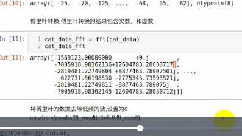


### 多层索引


#### 创建多层索引

Series 多层索引

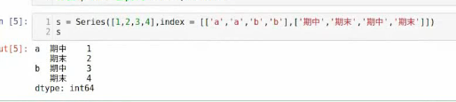


DataFrame多层索引：隐式构造

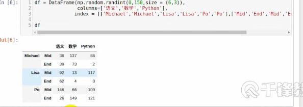


#### datafrme 显示构造索引


#### 多层索引

from_arrays


元祖创建， 多个元祖放在列表中进行创建

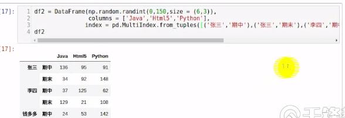

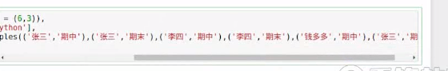

使用 product

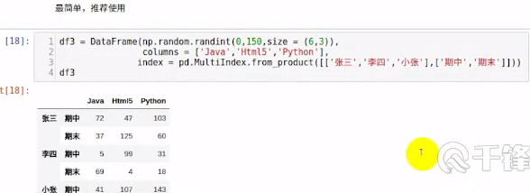


index和columns 都可以使用多层索引

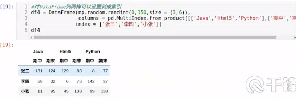


#### 多层索引获取数据

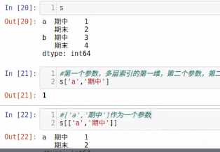


切片

`s.iloc[0:3]`


#### DataFrame操作

df1

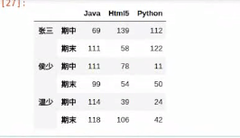

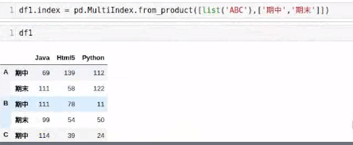


对于二维的索引，在进行切片时，如果有中文，有 Bug,无法切片


#### 索引的堆 (stack)

*   stack()
*   unstack()

堆：先进后出

*   level 哪一个，哪个就消失，出现在另一个轴中， 默认是 -1
*   列的level,从上往下 0，1，2 . . . ，unstack() 时，行的索引也是相同的方法，
*   也可以使用 -1倒序进行查找 level


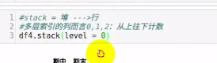

### 聚合操作

 axis 是哪个，那个就保留


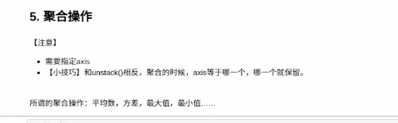

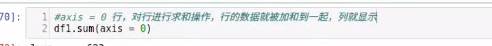


std() 方差， 方差越大，数据越不稳定，说明数据的波动大


### 拼接操作


### Connect


`pd.concat((df1, df2), axis=0)` 默认的 axis 是 0 ，行方向上进行级联，可以指定轴进行级联


DataFrame 支持，相同的列名，但是不建议创建列名相同的df， 因为 df 的列名就是它的属性

```python
def make_df(cols, inds):
    data = {c: [c + str(i) for i in inds] for c in cols}
    return DataFrame(data, index=inds, columns=cols)

df1 = make_df(list("AB"), [1, 2])
df2 = make_df(list("AB"), [2, 3])
pd.concat([df1, df2]) # 默认是行

x = make_df(list("XY"), ["a", "b"])
y = make_df(list("XY"), ["A", "B"])
display(x, y)
```

`pd.concat([x,y], keys=["X", "Y"])` 指定级联的列

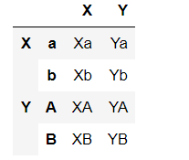

##### 行或者列不匹配级联

外连接：默认 不匹配的地方为 NaN

`df1 = make_df(list("AB"), [1,3])`

`df2 = make_df(list("BC"), [2, 4])`

outer是交集，inner是属性的并集


指定连接的轴：join_axes=[df1.columns]， 指定哪个DataFrame的列作为索引进行合并


### append() 添加

*   append 是dataframe 的方法，append 函数比 concat 更加灵活

在数据的后面进行添加，默认是添加的行 axis=0

`df1.append(df2)`  将 df2 直接添加在 df1 后面


### merge() 合并

`pd.merge(left, right)` 

*   merge和concat的区别：merge需要依据某一个共同的行或者列进行合并
*   使用pd.merge() 合并时，会自动根据两者相同的 column 名称的列，作为 key 进行合并。
*   注意每一列元素的顺序不要求一致

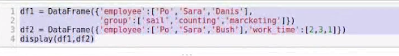

#### 一对一合并

*   有一列是对应的

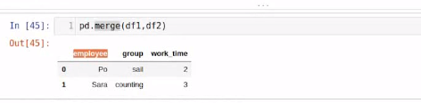

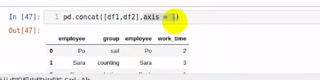


#### 多对一合并

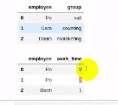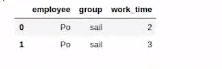


#### 多对多合并

*   进行多对多合并是，每个数据都没有放过

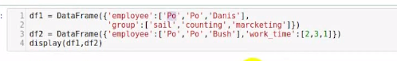

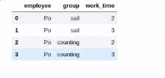

#### 使用keys 规范化

*   当有两个列都是相同时  on=显示指定哪一列为key,当有多个 key 时使用
*   如果不指定合并的列，只会在所有的列都相同时才进行合并
*   指定了 on=  参数，只会在指定的列内相同时进行合并
*   suffixes=["", ""] 指定合并后其他相同的列的后缀，方便区分
*   left_on / right_on 对左右两边进行指定合并对应的列

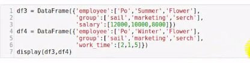


#### 内合并和外合并

内：只保留两者都有的， 交集， 默认方式

外：保留所有的，并集


左合并，右合并

how="left"  保留左边的数据

how="right"


#### 列冲突

可以指定 on 参数来进行合并，suffixes 指定后缀名来区分

pd.read_csv() 读取到的数据自动转化为 DataFrame 


### 删除重复的元素

`df.duplicated()` 检测重复的行， 返回布尔类型的Series对象， 每个原酸对应一行， 如果不是第一次出现， 则元素为 True

检测的是所有的行是否重复，行内的对应的列是不是相同

*   参数，`df.fuplicated(keep="first")` 默认， keep -> first 默认  last 最后一个 Flase 不保留，全部删除

`df.drop_duplicates()`将重复的数据进行删除，保留第一次出现的那条，只能删除行


列重名之后，不能进行去重操作


### 映射

#### map()函数，新建一列

*   在原来的列的基础上进行修改，得到一个新的列，会将选中的列进行传到map函数中进行运算， 可以使用 lambda 函数，也可以使用 自定义的方法
*   `df2["HTML5"] = df2["Java"].map(lambda x: x + 3)`
*   map 不能使用 sum 等函数，不能有迭代

```python
def adds(item):
    return 10
df["UI"].map(adds)  # 给列赋值


def square(item):
    if item == np.nan:
		return 0
    else:
        return item ** 2
```

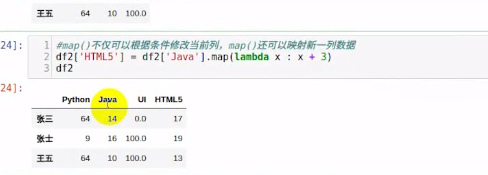

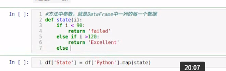

`df.astype(int)` 转化为 int 类型


`df.loc["index", "column"]` 选取索引


#### transform()

*   和 map() 类似，也可以使用方法

#### rename() 替换索引

`df.rename(index=new_index)`

`df.rename(columns=columns)`


### 异常值检测和过滤

使用 describe() 函数查看每一列的描述性统计

*   count 列的元素的个数
*   mean 平均值
*   std  标准方差，描述数据的波动，离散程度
*   min  最小
*   max  最大

数据小于标准方差的四倍，认为数据是有意义的

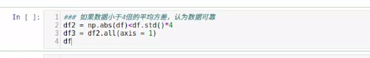


### 排序

*   使用 `.take()` 函数进行排序
*   借助 `np.random.permutation()` 函数进行随机排序
    *   `np.random.permutation(6) ` 随机生成 0-5 6个数

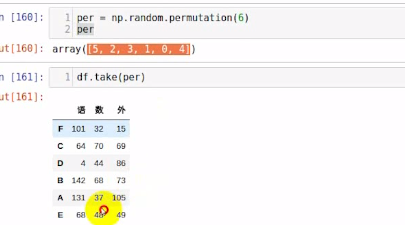

#### 可以用于随机抽样


### 数据聚合

数据聚合是数据处理的最后一步， 通常是要使用每一个数组生成单一的数值。

数据分类处理

*   分组：把数据分为几组
*   用函数处理：为不同的数据应用不同的函数以转换数据
*   合并：把不同的组的得到的结果合并起来

分类处理函数：`groupby()`

*   `df.groupby([]"item", "item2"])` 可以传入一个或者多个进行分组 
*   分组后得到的是一个 DataFrame 对象，调用 .groups() 查看所有的分组
*   如果进行多个条件分组，得到的是多层索引

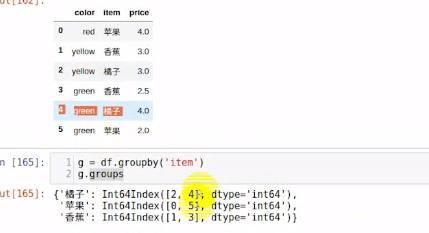

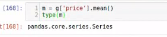

### 高级聚合

*   可以使用 `pd.merge()` 函数将聚合操作的计算结果添加到 df 的每一行
*   使用 groupby 分组后调用聚合函数进行操作，最后可以调用add_prefix()，来修改列名

##### 使用transform 和 apply 实现相同的功能

```python
df = DataFrame({"item" : ["萝卜","白菜","冬瓜","辣椒","白菜","冬瓜","辣椒", "萝卜"],
               "color": ["green","red","white","black","green","white","red", "white"],
               "weight": np.random.randint(50, 150, size=8),
               "price": np.random.randint(1, 4, size=8)})
df

df.groupby("color").groups
df.groupby("color")["price", "weight"].sum()
# 效果和 sum 是相同的
df.groupby("color")["price", "weight"].apply(sum)
df.groupby("item")["price"].apply(add_all)

def add_all(item):
    a = 0
    for i in item:
        a += i
    return a

# 将运算结果显示给所有的数据df.groupby("color")["price", "weight"].sum()
# 可以增加 自定义方法
df.groupby("color")["price", "weight"].transform(add_all)
```


### Series() 替换

```python
s1.replace({100: "A", 80: "B"})
s1.replace([100, 90], ["A", "B"])
s1.replace(to_replace=100, method="bfill")
```


### DataFrame() 替换

```python
df.replace(to_replace="Beijing", value="首都")
df.replace({4: "Beijing"}, "首都")   # 4 代表第四列
df.repalce([100, 200, 300], ["A","B","C"])  # 和 Series 相似
df.replace({100: "A", 200: "B", 300: "C"})  # 即使想要替换掉值并不存在，也不会报错
```


`df["column_name"]` 得到一个  Series

`df[["column_name"]]` 得到一个 DataFrame


`pd.read_csv()` 可以最大读取 1G 的数据


`.head()  .tail()` 查看前面，后面几个，默认是 5 条


`.unique()` 查看列中的元素中的所有，不重复的情况下，展示的是去重的结果


`ndarray.cumsum()`  累加， 后面一个加在前面一个


`s1.reset_index()`  Series 多重索引进行重置索引


DataFrame() 对象还支持  query () 方法

`df.query("index_name='要查找的列' & column_value=查找的值 ")`


### 透视表和交叉表

原表

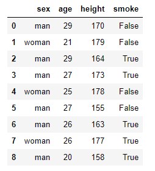

```python
# 透视表
pd.pivot_table(data=df,index=["sex"], values=["smoke"], 
                aggfunc="sum")

```

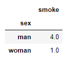

```python

# 交叉表
# 交叉表应该注意，传入的是行的索引，和 列的索引
pd.crosstab(df.sex, df.smoke)
```

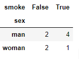