## Series和DataFrame绘图

[代码](https://github.com/zhangMingLu/grocery/blob/master/04-%E6%9C%BA%E5%99%A8%E5%AD%A6%E4%B9%A0%E6%95%B0%E5%88%86%E6%9E%90/%E6%9C%BA%E5%99%A8%E5%AD%A6%E4%B9%A0%E5%9F%BA%E7%A1%80%E6%95%99%E7%A8%8B/pandas%E7%9A%84Series%E5%92%8CDataFrame%E7%BB%98%E5%9B%BE.ipynb)

### 可视化

```python
ts = pd.Series(np.random.randn(1000), 
               index=pd.date_range("1/1/2000", periods=1000))
ts = ts.cumsum()
ts.plot()
```

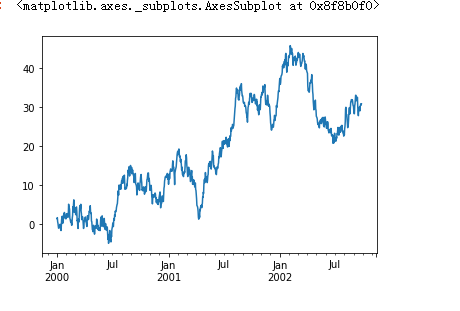

```python
import matplotlib.pyplot as plt

df = pd.DataFrame(np.random.randn(1000, 4), 
                 index=ts.index, 
                 columns=["A","B","C","D"])
df = df.cumsum()
plt.figure()
df.plot()
plt.legend(loc="best")
```

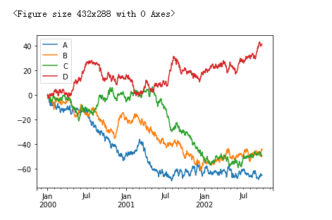


### 读取和保存 csv 文件


```python
# csv
df.to_csv("test.csv")

pd.read_csv("test.csv")

# HDF5
df.to_hdf('foo.h5', 'df')
db.read_hdf("foo.h5", "df")

# Excel
写入
df.to_excel("foo.xlsx", sheet_name="Sheet1") # sheet1 2 3 4 5
读取
pd.read_excel("foo.xlsx", sheet_name="Sheet1", index_col=None,
             na_values=["NA"])
```


### pandas 绘图 Series 和 DataFrame

Series和Dataframe 都有一个用于生成各类图表的 plot 方法，默认情况下，生成的图形是线形图

```python
df = DataFrame(np.random.randint(0, 30, size=(10, 4)), 
                                index=list("asdfghjklo"),
                                columns=list("ASDF"))
df
```


`df.plot(title="DataFrame")` 默认的线形图

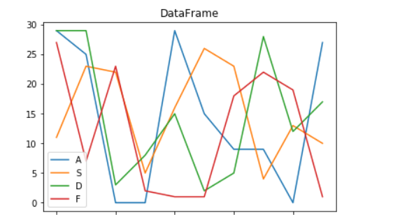

#### 柱状图 bar, 水平柱状图 barh

`df.plot(kind="bar")`

`df.plot(kind="barh")`

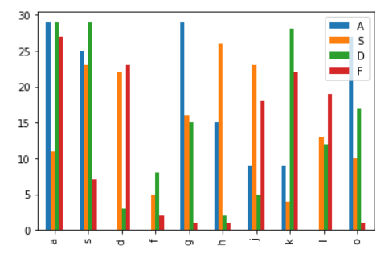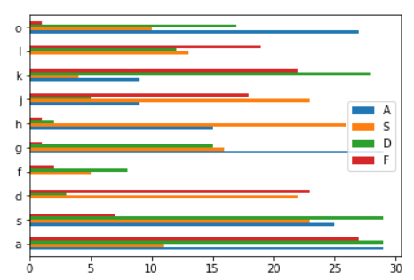


`set_index("column_name")` 可以将 df 中的某一列转化为 行索引


#### 直方图

```python
nd = np.random.randint(0, 5, size=10)
s = Series(nd)
s.hist()  # 绘制直方图
s.hist(bins=100)  # bins 默认是index的数量, bins越小每个数据之间的间隔越大， 描述的数据区间，表示将一组数据在最大和最小之间分割成多少份进行统计
```


- 直方图是一种可以对值和频率进行离散化显示的柱状图
- 直方图反映的是概率问题

下图中反映的是每个数出现的次数

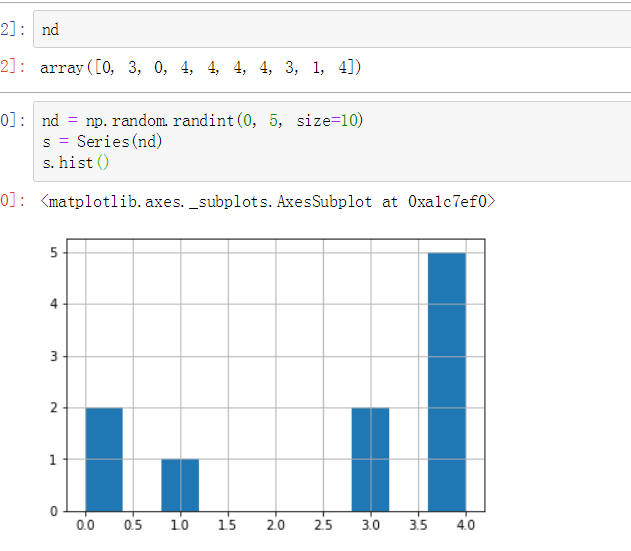


#### 随机百分比密度

`s = Series(array([0, 3, 0, 4, 4, 4, 4, 3, 1, 4]))`

`s.plot(kind="kde")`

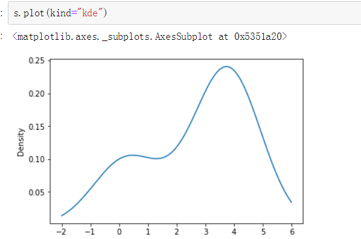

直方图经常和随机百分比密度图放在一起，直方图可以格式化的给出统计的结果（一边给出面元化密度），然后在其上绘制和密度估计


#### 正态分布

hist 中， density=True, 将两张图绘制在一起

```python

nd1 = np.random.normal(165, 10, size=100)
nd2 = np.random.normal(65, 10, size=100)

# 使用级联连接
nd = np.concatenate([nd1, nd2])
s = Series(nd)
s.hist(bins=10, density=True, color="green") # 直方图
s.plot(kind="kde", style="--", color="red")  # Destiny 密度图
```

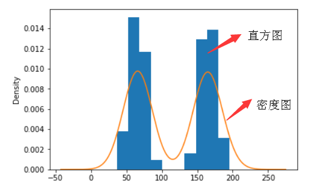

#### 散点图

散点图，也叫散布图， 是观察两个一维数据列之间的关系的有效方法

使用 kind="scatter" 注意给明标签， columns

```python

nd = np.random.randint(0, 50, size=(100, 5))
df = DataFrame(nd,columns=list("XYABC"))
df.plot(x="X", y="Y", kind="scatter")
```

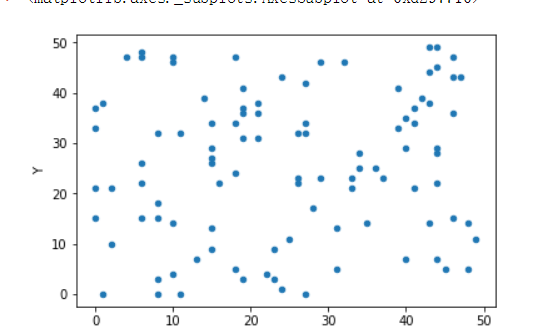

#### 散点图矩阵图

```python

pd.plotting.scatter_matrix(df, diagonal="hist") 

diagnoal  对角线显示的图形的类型， 默认是 hist 直方图, 也可以自定义，下图为kde概率图等
```


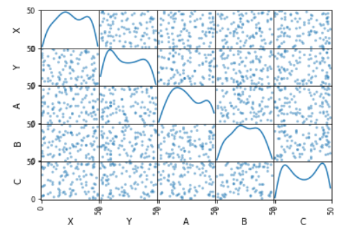

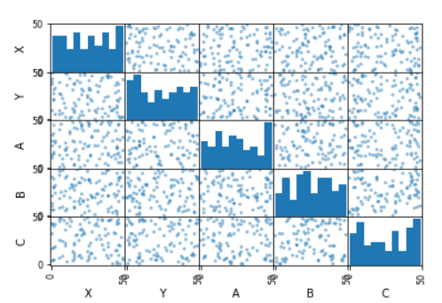


