## matplotlib绘图

[代码](https://github.com/zhangMingLu/grocery/blob/master/04-%E6%9C%BA%E5%99%A8%E5%AD%A6%E4%B9%A0%E6%95%B0%E5%88%86%E6%9E%90/%E6%9C%BA%E5%99%A8%E5%AD%A6%E4%B9%A0%E5%9F%BA%E7%A1%80%E6%95%99%E7%A8%8B/matplotlib%E7%BB%98%E5%9B%BE.ipynb)


### 灰度化处理

- 彩色图片是三维数据
- 黑白图片是二位数据

#### 最大值法

彩色图片读取后是一个三维的ndarray

```python

img = plt.imread("./test.jpg")
# 数据的第三维是色彩维度
# 获取第三维 最大值， 得到降维的效果, 颜色值越大， 图片越亮
# 也可以求平均值 img_data.mean(axis=-1)
img_g = img_data.max(axis=2)
# 展示降维度之后的图片效果
plt.imshow(img_g， cmap="gray")
```

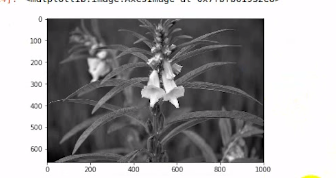

#### 加权平均法

科学研究得到人眼对色彩的权重：

- R：0.299
- G：0.587
- B：0.114

```python

a = np.array([0.299. 0.587. 0.114])
img_data3 = np.dot(img_data, a)  # 将权重进行矩阵的乘法， 最后得到的结果过，原矩阵的 shape 变为二维
```


### Matplotlib绘图,基础知识

Matplotlib中的基本图表包括的元素：

- x 轴和 y 轴   
- x 轴和 y 轴的 刻度， 最大刻度和最小刻度
- x 轴和 y  轴的 标签，表示特定坐标轴的值
- 绘图区域  实际绘图的区域

#### 只含单一曲线的图

```python
x = np.linspace(0, 100, 10)
plt.plot(x)   # 只传入一个参数， 默认是 y 轴的参数， x 轴的数会自动根据 y 的下标进行补偿
plt.plot(x, y) # x, y 都有对应的值
```


#### 一个图中包含多个曲线的图

```python
x = np.arange(0, 10, 1)
plt.plot(x, x*2)
plt.plot(x, x*3)
plt.plot(x, x*4)
```

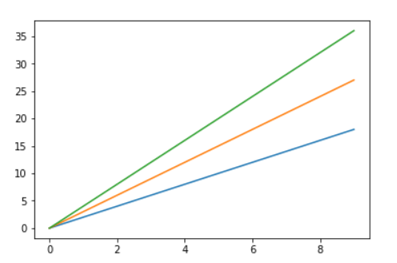

```python
plt.plot(x, x*2, x, x*5, x, x/3)
```

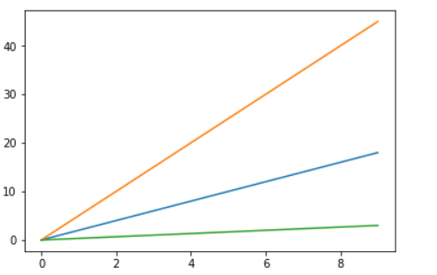

#### 添加网格

`plt.grid(True)`

```python
x = np.arange(-np.pi, np.pi, 0.01)
plt.plot(x, np.sin(x), x, np.cos(x))
plt.grid(True)
```

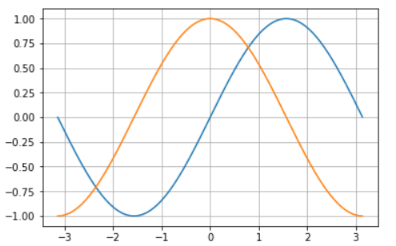

设置grid参数， 使用 plt 的面相对象的方法，创建多个子图显示不同的网格线

```python

# 设置画布的大小
plt.figure(figsize=(12, 9))

# 定义第一个画板， 1行，3列， 第 1 个, 也可以写作 axes=plt.subplot(131)
axes = plt.subplot(1, 3, 1)
plt.grid(color="r", linestyle="--", linewidth=2)
axes.plot(x, np.sin(x))

# 定义第儿个画板， 1行，3列， 第 2 个
axes2 = plt.subplot(1, 3, 2)
plt.grid(color="g", linestyle="--", linewidth=2)
axes2.plot(x, np.cos(x))

# 定义第三个画板， 1行，3列， 第 3 个
axes = plt.subplot(1, 3, 3)
plt.grid(color="k", linestyle="--", linewidth=2)
axes.plot(x, np.sin(x))
```

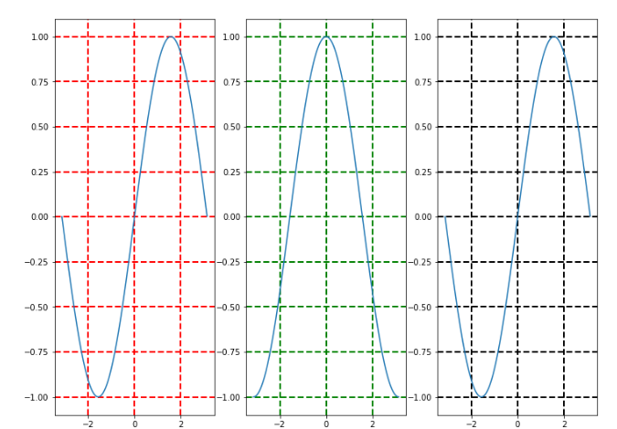

#### 坐标轴的界限, 设置坐标轴

`plt.axis("off")` 不显示坐标轴， 只显示图形

- scaled  改变画布的大小，使刻度变得一致
- tight  默认情况
- equale  坐标轴的 刻度 长度是一致的， 不改变画布的大小

```python
x = np.random.randn(10)
# 设置坐标轴的 界限， 建议和 figure.figsize 一起调整，比例保持一致，否则会导致图像比例失调
plt.axis([-3, 10, -2, 2])
plt.plot(x)
```

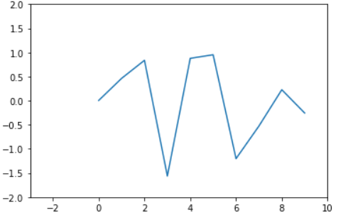

##### xlim和ylim方法

除了plt.axis方法，还可以通过xlim,ylim 方法设置坐标范围

```python
y = np.arange(0, 10, 1)
plt.xlim(-2,12)
plt.ylim(-2,10)
plt.plot(y)
```

##### 坐标轴刻度设置

- xticks([刻度值列表]， [标签列表])   传入需要设置的值的列表
- yticks()

##### 坐标轴标签 xlabel和ylabel

- rotation 旋转
- size 大小
- horizontalalignmen  : right  left  水平向左， 向右

```python
y = np.arange(0, 10, 1)
plt.xlabel("x的标签"， rotation=60) # 旋转60度
plt.ylabel("y的标签"， size=20) # size设置大小
plt.plot(y)
```

#### 标题

`plt.title("title")`   不能含有中文

- rotation 旋转
- size

```python

plt.title("title", fontsize=20)
#  loc 位置  center  right left
```

#### 图例  legend

- loc 图例的位置， 默认是 best 空位置， 也可以以坐标元组  
- loc=(0.5, 1), 相对值， 相对于图片的宽高， 1个图片的宽度单位
- (1, 0) 右下角  
- ncol 控制图例的列数, 默认是 1

```python
x = np.arange(0, 10, 1)
plt.plot(x, x, x, x**2, x, x/2)    
plt.legend(["normal", "fast", "slow"], loc="right"， nloc=3)  # 这里 加 _ 没有影响
     # 
# 或者  分别设置每条线的标签， 然后调用 plt.legend() 显示
plt.plot(x, x, label="normal")
plt.plot(x, x**2, label="fast")
plt.plot(x, x/2, label="slow")
plt.legend()  

# label 属性前加 _ 图例不会显示， 直接不写label也可以
plt.plot(x, x, label="normal")
plt.plot(x, x**2, label="_fast")  # 这个就不会显示
plt.plot(x, x/2, label="slow")
plt.legend()  
```

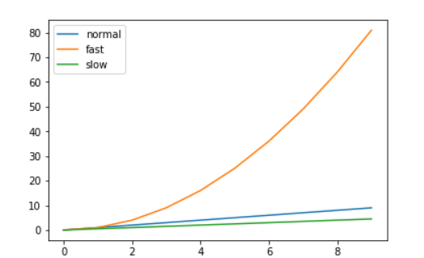

### 保存图片

`plt.savefig()` 保存图片

参数： 

- fname 文件名 'xxx.jpg'， 也可以保存 pdf
- dpi 分辨率， 默认是100，分辨率越大图片越细腻
- facecolor  背景色
- papertype 纸的样式
- orientation `[lan]`  水平，数值


### 设置plot风格样式

#### 颜色

##### 颜色  color / c

- 颜色的英文名
- 颜色的十六进制--共6位， 如果写为 8 位， 则前两位是 透明度
- RGB值，归一化的 [0-1] 的 比例式的值

##### 透明度  alpha

- alpha  0-1  越小越透明

##### 背景色  facecolor

`axes = plt.subplot(facecolor="green")`  定义画板的背景色

#### 线条

##### 线型 linstyle / ls

- `-` 实线
- `--` 破折线
- `-.`点划线
- `:`虚线
- `steps`阶梯线
- `None`  隐藏线

##### 线宽 linewith / lw

`lw=2` 默认值是 1  float

##### 不同宽度的破折号  dashes

`dashes=[2, 5, 2, 10, 1]` 一个线段长 一个间隔

##### 点型 

- marker  有很多，暂时举例几个
- markersize  大小
- markerfacecolor 
- markeredagewidth
- markeredagecolor

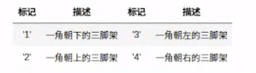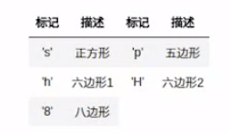


##### 参数连用  format

颜色、点型、线型

`r-.o`

##### 更多设置

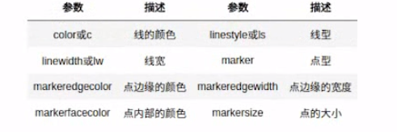


##### 多个曲线同时设置

设置时不声明属性名称，会将属性给最近的一条线

```python

x = np.arange(0, 10, 0.01)
plt.plot(x, 2*x, x, np.sin(x), c='r', ls='--', lw=4)
```

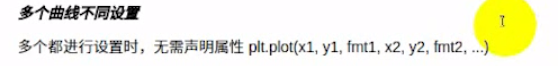


##### setter() 方法设置

- set_color

```python
# 返回的是一个列表
line1,  = plt.plot(x, sin(x))
line1.set_facecolor('r')  # 设置背景颜色
line1.set_title("标题")

line1.set_label()
```

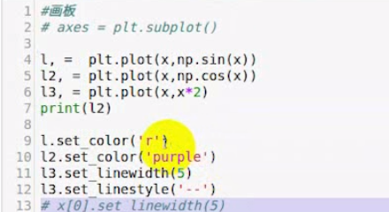

##### setp() 方法设置属性

```python

line, = plt.plot(x, np.sin(x))
plt.setp(line, linestyle="--")
line.setline_width(15) # 设置线宽
```


```python
x1 = np.random.randn(10)
x2 = np.random.randn(10)
x3 = np.random.randn(10)

plt.plot(x1.cumsum(), color='r', linestyle='--', marker='o')
plt.plot(x2.cumsum(), color='y', linestyle='-.', marker='>')
plt.plot(x3.cumsum(), color='m', linestyle=':', marker='*')

plt.legend(["x1", "x2", "x3"])
```

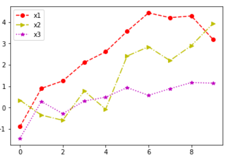


#### 坐标轴

##### 刻度

`xticks, yticks`

```python
x = np.random.randn(100)
plt.plot(x.cumsum())
plt.xticks(np.linspace(0, 100, 5), list("ABCD"), rotation=90)   # 角度
plt.yticks(np.linspace(-10, 20, 3), ['min', 'mid', 'max'], fontsize=10)  # 字体大小
```

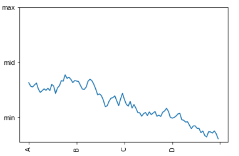


##### 面型对象的方法

```python

axes = plt.subplot(121)
axes.plot(x, np.sin(x))
axes.set_xticks()  # 设置刻度
axes.set_xtickelabels() # 设置刻度标签
```


#### 绘制拉丁字母

- `'$\pi$'` 圆周率 π
- `$\delts$ ` delta

```python

x = np.arange(-np.pi, np.pi, 0.01)
plt.plot(np.sin(x))
plt.plot(np.cos(x))
plt.yticks([-1, 0, 1], ['min', 0, 'max'])
plt.xticks([0, 150, 300, 450, 600, 750], ['$\pi$', ''])
```


