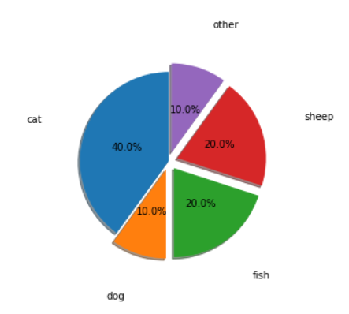
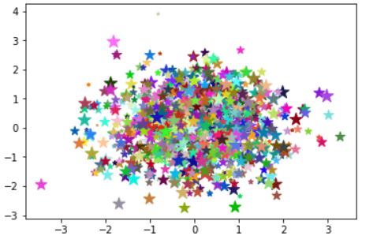
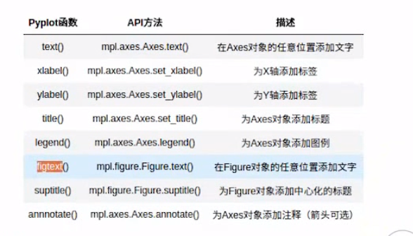
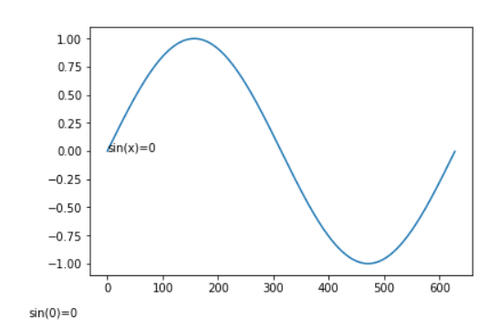
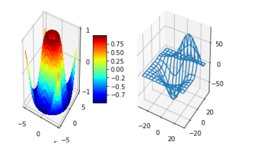
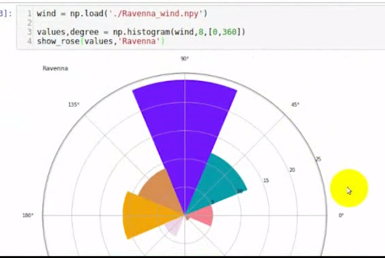

## matplotlib绘图-小结


### 直方图 hist

hist ,  `plt.hist(x)`, 表示的是出现的次数， 统计的结果， 表示的是概率

查看数据的分布情况

*   orientation 创建水平方向 的直方图


### 密度图  kde

一般和直方图，一起，表达数据的分布趋势

-   设置 直方图的 `density=True`, 两个图同时显示


### 条形图 bar

`plt.bar(x)`  `plt.barh(x)`


### 饼图  pie

表示各个部分占的比例 `plt.pie()`

- labeldistance 
- pctdistance
- startangle
- colors


```python
p = np.array([0.4, 0.1, 0.2, 0.2, 0.1])

# plt.figure(figsize=(4, 4))  # 变圆  
plt.pie(p, labels=['cat', 'dog', 'fish','sheep', 'other'],
        autopct="%1.1f%%", #  autopct 显示格式
        pctdistance=0.5,  # 显示的结果距离中心的举例， 比例值
        labeldistance=1.5,  # 标签的举例
        explode=[0, 0.1, 0.1, 0.1, 0.1],  # 爆炸图， 中心的比例
        shadow=True,   # 阴影
        startangle=90   # 旋转，逆时针
       )
plt.axis('equal')  # 变圆
```




### 散点图  scatter


显示数据的关系
```python
x = np.random.randn(1000)
y = np.random.randn(1000)
color = np.random.random(3000).reshape(1000, 3)
size = np.random.randint(1, 200, 1000)
plt.scatter(x, y, color=color, s=size, marker='*')
```



#### 图形内的文字、注释、箭头



##### 文本 text / figtext


```python
x = np.arange(0, 2*np.pi, 0.01)
plt.plot(np.sin(x)) 

plt.text(0, 0,"sin(x)=0" )# 文本， 位置坐标， 坐标系内的文本
plt.figtext(0, 0, "sin(0)=0")  # 相对图片的位置，外面的文本
```



##### 注释 annotate, 箭头样式

```python
x = np.random.randint(0 ,10, size=10)
x[5] = 30  # 注释这个点
plt.plot(x)
plt.ylim([-2, 35])
 # 注释 
plt.annotate(s="this is important",  # s 注释，
             xy=(5, 30), #  xy 注释箭头
             xytext=(6, 31),  #  文本位置
#              arrowprops={"width":5,  # 箭头样式设置
#                          "headwidth": 10,
#                         "headlength": 10,
#                         "shrink": 0.1},
            # 第二种设置方式
            arrowprops={"arrowstyle": "->"}
            )   

```


### 3D图形

[视屏](http://www.codingke.com/v/6215-lesson-328-course)

```python

from mpl_toolkits.mplot3d.axes3d import Axes3D
from matplotlib import cm

fig = plt.figure()

ax = fig.add_subplot(1, 2, 1, projection='3d')
X = np.arange(-5, 5, 0.25)
Y = np.arange(-5, 5, 0.25)
X, Y = np.meshgrid(X, Y)
R = np.sqrt(X**2 + Y**2)
Z = np.sin(R)
surf = ax.plot_surface(X, Y, Z, rstride=1, cstride=1, cmap=cm.jet,
        linewidth=0, antialiased=False)
ax.set_zlim3d(-1.01, 1.01)

#ax.w_zaxis.set_major_locator(LinearLocator(10))
#ax.w_zaxis.set_major_formatter(FormatStrFormatter('%.03f'))

fig.colorbar(surf, shrink=0.5, aspect=5)

from mpl_toolkits.mplot3d.axes3d import get_test_data
ax = fig.add_subplot(1, 2, 2, projection='3d')
X, Y, Z = get_test_data(0.05)
ax.plot_wireframe(X, Y, Z, rstride=10, cstride=10)

plt.show()
```



### 玫瑰图、 极坐标图

特殊的条形图

```python
def show_rose(values, title):
    # 玫瑰图花瓣的数量 8 每瓣45度
    n = 8
    angle = np.arange(0, 2 * np.pi, np.pi/n)
    
    # 绘制数据的 values
    radius = np.array(values)
    # axis 代表轴
    # axes 代表整个画面  
    # polar 极坐标
    plt.axes([0, 0, 1, 1], polar=True)
    color = np.random.random(size=24).reshape((8,3))
    plt.bar(angle, radius, color=color)  # align = center/edge
    plt.title(title)
    
  
v = [1, 2, 3, 4, 5, 6 ,7, 8]

show_rose(v, "test")
```





