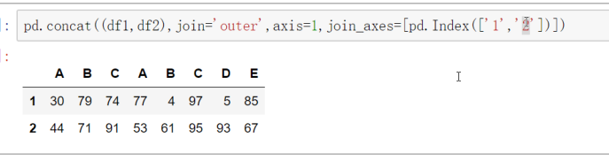

day01

顺序表

-   逻辑结构
-   存储方式

线性表

-   ​

索引是相对于首地址的偏移量

`set_index` 重新设置索引， 使用列

必须是 index 对象

#### 级联的参数

`pd.concat()`

-   axis  轴 0-1
-   join  级联的方式 innder outer
-   join_axes   `[pd.Index([index1, index2 ..])]`
-   ignore_index   是否忽略原索引， True, False
-   keys  设置级联后分区的名称

#### 合并的参数

`pd.merge()`

-   on  指定合并的标签 [label1, label2 ... ], 设置合并参考列的参数
-   left_on / right_on  分别设置左右两个表的合并参考，一般在两个表不存在相同的列标签的情况下
-   left_index / right_index  分别设置是否以左右行行索引为合并参考
-   how   innder  outer left right
-   suffiex  设置没有参与合并的相同的参考列的区分后缀

map是 Series 的函数，不是 DataFrame 的函数

### map 和 apply

- map 不支持，迭代函数， 因为每次传入的是一个值
- apply 支持迭代函数，因为是将整行或者整列传入到函数

