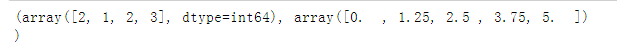
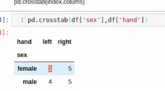

matplotlib应用


支持向量机回归参数

```python

# 导入机器学习的模型
from sklearn import SVR

# 创建算法
svr1 = SVR(kernel="linear",  # 线性
          c=1.0)  # 惩罚系数, 对数据的要求
# 将数据交给算法,进行训练
svr1.fit(x1, y1)

# 预测数据
y_test = svr1.predict(x_test)
```


```python
x = np.array([1, 1, 2, 3, 3, 4, 4, 5])

# 将 x 分为 4 份, 范围是 0 - 5, 得到的是一个范围内的数量的数组, 
# 第二个数组是划分的点
np.histogram(x, 4, [0, 5])
```




### pandas数据加载

透视表和交叉表

##### read_csv

read_csv  将 csv 文件转化为 DataFrame

read_csv 也可以读物其他符号分割的数据,  设置 sep 参数,默认是 `,`, 可以修改

##### read_table

读取 tab 键分割的数据

也可以 使用`read_csv("", sep="\t", header=None)`


#### 读取数据库的数据

```python
import sqlite3

conn = sqlite3.connect("./file_name.sqlite")
pd.read_sql("select * from weather_2012", conn)
```


#### 数据透视表

参数

- index 要透视的哪一列, 该列的值会转化为行, 如果有多个还可以设置
- columns  展示的列

```python

index
df.pivot_table(index="")
```


#### 数据交叉表

`df.crosstab(index, columns)`

- margins True 表示显示边界



<https://www.Data.gov> 美国数据网站