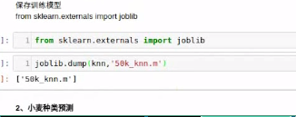

## 机器学习分类和算法介绍

#### 有监督

- 有答案的
- 商用最多的，主要是分类

#### 无监督

- 没有答案

#### 半监督

- 部分有答案
- 使用有答案的数据进行训练模型，然后使用陌生数据进行验证


#### 分类问题

- kNN
- 贝叶斯
- SVM

#### 回归问题

- 线型回归
- 岭回归
- 逻辑斯蒂回归，也可以处理分类问题，回归算法处理分类问题


#### 聚类算法

k_means()

用户定位，分类，契合产品的需求，将不同价位的产品推送给不同的用户


#### 深度学习

算法的组合

通过将样本拆分成不同的类型进行不停的学习


#### kNN

k近邻算法

##### 距离

- 抽象的问题

#### 保存模型和加载保存的模型

```python
from sklearn.externals import joblib


# 保存模型
joblib.dump(knn, 'knn_ss.m')
# 加载模型
joblib.load('knn_ss.m')
```





#### 映射处理非数字类型数据

如果数据之间存在大小关系，可以将其转化为数字进行计算距离

-   用逻辑字典进行映射处理


颜色，不存在大小关系的映射,使用编码进行特征转码

- LabelEncoder  标签编码
- OneHotEncoder   独热编码

标签转数字，将原始数字中的索引来决定的

红黄蓝 -  010 100 001

```python
from sklearn.preprocessing import LabelEncoder, OneHotEncoder

colors = pd.Series(['red', 'green', 'blue'])

label_enc = LabelEncoder()
label_code = label_enc.fit_transform(colors)

# 构建独热编码转化器
onehot_enc = OneHotEncoder()
# 在对已经做过数字编码的集合进行转码
# todense() 读取转化后的矩阵内容
martrix_data = onehot_enc.fit_transform(label_code.reshape(-1, 1)).todense()
```


### 特征选择

-   降低算法的复杂度
-   剔除无效特征对训练模型的影响


