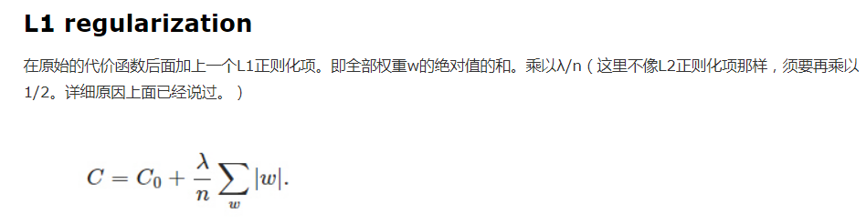
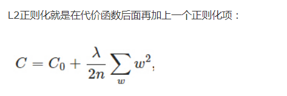

#### 过拟合和欠拟合

- 过拟合：使用样本的特征过多，导致很多无用的特征被加入到计算中，导致模型泛化受到过多无用特征的影响，精度变得很低
- 欠拟合：在选取特征时，选取的过于简单，主要的特征没有获取，导致模型在测试集上的表现很差

### [正则化方法](https://www.cnblogs.com/yxwkf/p/5268577.html)

#### L1 regularization

行方向抓取

拉格朗日

#### L2 regularization  （权重衰减）

列方向抓取

最小二乘

