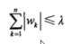
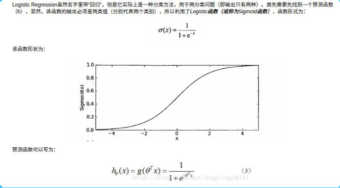

### 岭回归和Lasso回归

*   实践中，一般首选岭回归，但是如果特征很多，但是只有其中的几个是重要的，那么选择Lasso回归可能效果会更好
*   sklearn还提供了 **ElasticNet** 类，结合了 Lasso 和 Ridge 的惩罚项，实践中，这种结合的效果是最好的，不过需要调节俩个参数，一个用于 L1,一个用于 L2

#### 岭回归 Ridge

- 最小二乘法

岭回归是加了二阶正则项的最小二乘， 主要是用于过拟合严重和存在多重共线性，岭回归是有 bias 的，这里的 bias 是为了 vanance 更小

-   bias：
-   vanance：

引入偏差，让数据便于计算

会将无效的系数无限向0压缩，减少无效系数的影响


- 过拟合严重： x + y = 1  2x + 2y = 2
- 多重共线： 两个正相关的属性，同时对结果进行求解
- bias ：偏差
- vanance：

一般用于样本值不够的时候，样本的特征大于样本的数量，线性回归无法正确预测


##### 参数 alpha

-   alpha 为惩罚项
-   越大，系数压索越严重， 原始系数对结果的影响变小
-   alpha=0  变为线性回归
-   越小  原始系数对结果的影响增大

```python

from sklearn.linear_model import Ridge

ridge = Ridge(alpha=1.0)  # alpha 表示的是：当维度不够时给予的补充单位矩阵
```


#### Lasso 回归

- 使用的是拉格朗日乘法

和岭回归的区别：

-   和岭回归类似，算法不同
-   直接对系数进行修正，而岭回归则是对系数的压缩，Lasso回归会将无用的系数修正为0， 而岭回归只会无限压缩，让系数趋近于0


-   lasso 可以将系数压缩到0，压缩系数的强度大于岭回归
-   引入惩罚项，对参数 w 增加了限定条件
-   可以认为lasso是岭回归的加强，岭回归能解决的问题也可以使用lasso回归来解决，可以通过对比模型的精度来确定哪种模型更加可靠

##### 参数 alpha：

-   越大，惩罚力度越小，原始系数对结果的影响越小
-   越小，惩罚力度越大，原始系数对结果的影响越大


### 常见的线性分类算法

-   常见的两种线性分类算法是 Logistic 回归 和 线性支持向量机 SVM


#### 逻辑斯蒂回归  Logistic

根据数据对分类的边界线建立回归公式，目的主要是用于分类，属于**[梯度下降算法](https://blog.csdn.net/u013709270/article/details/78667531)**

函数原型，[西瓜书介绍](https://blog.csdn.net/macro_xjq/article/details/78838353)



-   逻辑斯蒂曲线主要是描述的是几率
-   默认使用的是 L2 正则化


**优缺点**：

- 优点：实现简单，易于理解和实现，计算代价不高，速度快，存储资源低
- 缺点：容易欠拟合，分类的精度可能不高

`from sklearn.linear_model import LogaisticRegression`

以回归的算法实现数据的分类

##### 参数 C

-   C 越大， 正则化越小，那么模型更强调使系数向量（w）接近0
-   C 值越大，LogisticRegression 和 LinearSVC 将尽可能的将训练数据集拟合到最好，


-   较大的 C 值更强调每个数据点都分类正确的重要性

强正则化的模型会选择一条相对水平的线，C值稍大，模型更加关注两个分类错误的样本，C值非常大时，决策边界的斜率会非常的大，模型可能会变得过拟合


