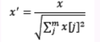
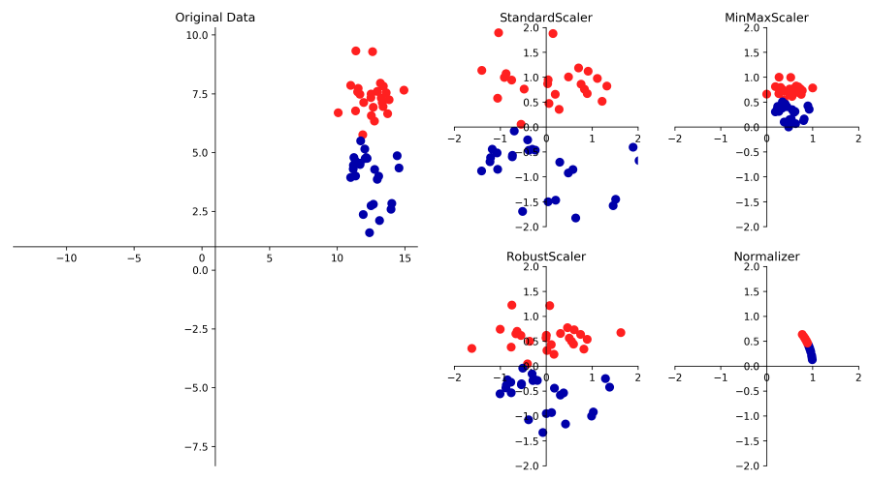

数据预处理和缩放


### 缩放器

所有的缩放器总是对训练集和测试集应用完全相同的变换，也就是说 transform总是减去训练集的最小值，然后除以训练集的范围，而这个值可能与测试集的最小值范围并不总是相同的

#### StandardScaler

-   确保每个特征的平均值为0、方差为1，使所有特征都位于同一量级，但是这种缩放不能保证特征的任何特定的最大值和最小值

#### RobustScaler

-   和StandardScaler类似，确保每个特征的统计属性都位于同一范围，使用的是中位数和四分位数，而不是平均值和方差，这样会忽略与其他店有很大不同的数据点，这些与众不同的点叫做异常值，可能会对其他的缩放造成麻烦

#### MinMaxScaler

-   移动数据，使所有特征刚好位于0到1之间，对于二维数组来说，所有的数据都包含在 x 轴0到1与y轴0到1之间


#### Normalizer

-   对每个数据点进行缩放，使得特征向量的欧式长度等于1，也就是将所有的数据点都投射到一个半径为1 的圆上




示意图



代码

```python
# 无量纲化处理，消除数据的特征由于量级的不同对数结果的影响
# 有些具有伸缩不变性的算法可以不用处理，如 Logistic
# 但是通常无量纲化处理是有利无害的

from sklearn.preprocessing import MinMaxScaler, StandardScaler, Normalizer 

data = load_iris().data
target = load_iris().target
# 区间缩放  MinMaxScaler  数据变为0-1 之间
MinMaxScaler().fit_transform(data)
# 标准化 数据符合正态分布
StandardScaler().fit_transform(data)
# 归一化
Normalizer().fit_transform(data)

# 特定域值二值化
from sklearn.preprocessing import Binarizer

train = np.array([[10, 11, 15, 9, 6, 7, 9, 8]])

Binarizer(threshold=10).fit_transform(train)
# 返回大于 阈值的为1  小于阀值的为 0

# 空值填充 Iminput

# 哑编码  LabelEncoder OneHotEncoder
```


### 降维、特征提取和流形学习

- 主要使用的是主成分分析，也有另外两种方法，非负矩阵分解（NMF）和 t-SNE，前者常用于特征提取，后者常用于二维散点图的可视化

#### 主成分分析  PCA

- 是一种旋转数据的方法，旋转后的头特征在统计上不相关，通常旋转后的数据对解释数据的重要性来选择它的一个子集，也就是选择方差较大的成分。
- PCA是一种无监督方法，在寻找旋转方向时没有用到任何类别的信息，它只观察数据的相关性

参数：

- n_components   要保留的主成分的个数，也可以设置为0-1之间的小数，表示保留的方差的百分比
- whiten   True 表示将主成分缩放到相同的尺度，变换后的结果和使用 StandardScaler 缩放效果相同，百化不仅对应于旋转数据，还对应于缩放数据使其形状是圆形而不是椭圆。

​    主成分保存在 PCA 对象的 components_ 属性中，可以通过查看`pca.components_`查看主成分，如果所有的特征符号相同，这就意味着所有的特征具有普遍相关性，一个值越大，其他值也会随着变大


#### 非负矩阵分解  NMF

- 是一种无监督算法，目的在于提取有用的特征

和PCA的区别：

- PCA中，我们想要的是正交分量，并且能够解释尽可能多的数据方差
- 在 NMF 中，我们希望分量和系数均为非负，也就是说，我们希望分量和系数都是大于或等于0的，因此，NMF 只能应用于每个特征分量都是非负的数据，因为非负分量的非负求和不可能变为负值。

如果有足够多的分量能够完美的重建数据，那么算法会指向数据极值的方向。

如果仅适用一个分量，那么，NMF 会创建一个指向平均值的分量，对数据做更好的解释


#### t-SNE进行流形学习

`from sklearn.manifold import TSNE`

流形学习算法：允许进行更复杂的映射，通常也可以给出更好的可视化，其中特别有用的是 t-SNE 算法

- 只能变换用于训练的数据

原理：

- 尽可能地保持数据点之间的距离
- t-SNE首先给出每个数据点的随机二维表示，然后尝试让在原始特征空间中距离较近的点更加靠近，原始特征空间中距离相距较远的点更加远离
- t-SNE重点关注的是距离较近的点，而不是保持距离较远的点之间的距离，也就是说，它得到的是哪些点比较靠近的信息。

#### 

### 聚类


#### K均值聚类


#### 凝聚聚类


#### DBSCAN (具有噪声的基于密度的空间聚类应用)

- 不需要设置簇的个数，会自动进行计算


#### 聚类算法的对比和评估

重要指标

- 调整rand指数  ARI
- 归一化互信息  NMI

