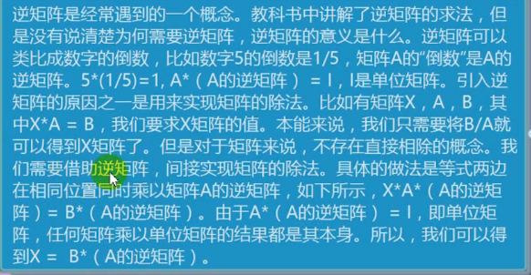

### 矩阵知识

#### 满秩矩阵

*   矩阵内部进行四则运算时后，行数和列数还是相同的
*   满秩矩阵求解释最精确的

#### 奇异矩阵

*   该矩阵不是满秩的，线性代数的概念
*   奇异矩阵可以通过岭回归求解

#### 判断满秩矩阵

*   `np.linalg.martrix_rank(ndarry)` 查看矩阵的秩，和数组的 shape 进行对比

#### 矩阵的逆

*   矩阵本身和自身的逆矩阵相乘得到的是单位矩阵

#### 求矩阵的的逆矩阵

`n_T = np.linalg.inv(ndarray)`

