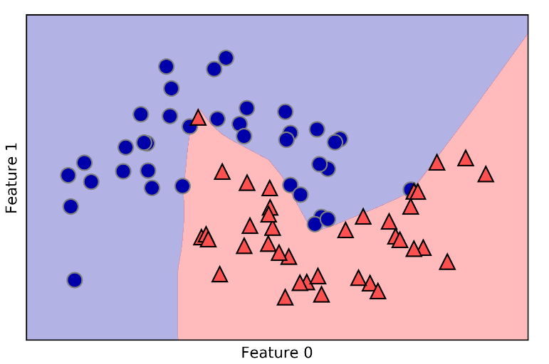

神经网络（深度学习）

​       深度学习算法往往经过精确调整，只适合用于特定的使用场景。较为简单的一种为 用于分类和回归的多层感知机（MLP），它可以作为研究更为复杂的深度学习方法的起点。MLP也被称为普通前馈神经网络，简称神经网络。


隐层：隐单元组成

在每个输入和隐单元之间有一个系数，每个隐单元与输出之间也有一个系数

可以有多个隐单元，也可以是多个隐层


```python

from sklearn.neural_network import MLPClassifier
from sklearn.datasets import make_moons

X, y = make_moons(n_samples=100, noise=0.25, random_state=3)

X_train, X_test, y_train, y_test = train_test_split(X, y, stratify=y,
                                                    random_state=42)

mlp = MLPClassifier(solver='lbfgs', random_state=0).fit(X_train, y_train)
mglearn.plots.plot_2d_separator(mlp, X_train, fill=True, alpha=.3)
mglearn.discrete_scatter(X_train[:, 0], X_train[:, 1], y_train)
plt.xlabel("Feature 0")
plt.ylabel("Feature 1")
```




在尅是学习之前，其权重是随机设置的，这样就导致同样的参数设置和训练模型，在随机种子不同的情况下，会得到不同的模型


神经网络也要求输入特征的变化范围相似，最理想的情况是均值为0、方差为1、我们也应该进行数据的缩放来满足这些要求。