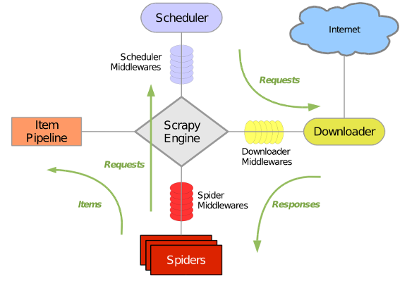

### Scrapy简介

​	一个为爬取网站数据， 提取结构新数据而产生的应用框架， 可以应用在包括数据挖掘， 信息处理或历史存储历史数据的一系列过程中。

Scrappy使用了Twisted异步网络请求库来处理网络通讯， 大致结构如下




安装

-    `pip install scrapy`


开启一个项目

-   `scrapy startproject YourProject`


运行项目

-   在 爬虫的文件目录下， `scrapy crawl qidian`


#### 各个文件的作用：

-   items.py     设置存储数据的 模型
-   middleware.py   中间件
-   pipelines.py    数据的持久化， 存储数据库
-   settings.py   配置文件

spiders文件目录用于存放 爬虫文件


#### 单个爬取


```python

import scrapy
from scrapy.selector import Selector


class QiDianSpider(scrapy.spiders.Spider):
    # 启动项目制定的name参数
    name = 'qidian'
    # 需要爬取的页面
    start_urls = {
        'https://www.qidian.com/',
    }

    # 解析页面
    def parse(self, response):
        print('-*' * 40)
        # 请求时的 url
        current_url = response.url
        # 返回的 THML 页面
        body = response.body

        # 返回的html unicode编码
        unicode_body = response.body_as_unicode()

        # 小说分类信息
        res = Selector(response)
        menu_type = res.xpath('//*[@id="classify-list"]/dl/dd/a/cite/span/i/text()').extract()
        menu_type_href = res.xpath('//*[@id="classify-list"]/dl/dd/a/@href').extract()
        print(menu_type, menu_type_href)
        print('<<<<' * 40)
        return response
```


#### 定义匹配规则进行批量爬取

```python

from scrapy.selector import Selector
from scrapy.linkextractors import LinkExtractor
from scrapy.spider import Rule, CrawlSpider

from qidianSpider.items import DoubanspiderItem

from utils.clearn_data import handle

# 继承 CrawlSpider
class DouBanSpider(CrawlSpider):

    name = 'douban'
    
    # 开始的url
    start_urls = {
        r'https://movie.douban.com/top250'
    }
    # 设置匹配规则
    rules = (Rule(LinkExtractor(allow=r'https://movie.douban.com/top250.*'), callback='parse_item'), ) # 自定义的回调函数


    # def start_requests(self):
    #
    #     for i in range(10):
    #         url = r'https://movie.douban.com/top250?start=%s&filter=' % i * 25
    #         yield scrapy.Request(url=url, callback=self.parse)

    def parse_item(self, response):

        res = Selector(response)
        items = DoubanspiderItem()
        # 电影名
        items['movie_name'] = res.xpath('//*[@id="content"]/div/div[1]/ol/li/div/div[2]/div[1]/a/span[1]/text()').extract()
        # 图片
        items['img'] = res.xpath('//*[@id="content"]/div/div[1]/ol/li/div/div[1]/a/img/@src').extract()

        # 导演演员信息
        director = res.xpath('//*[@id="content"]/div/div[1]/ol/li/div/div[2]/div[2]/p[1]/text()[1]').extract()
        items['director'] = [handle(info) for info in director]

        # 年份分类信息
        year_type = res.xpath('//*[@id="content"]/div/div[1]/ol/li/div/div[2]/div[2]/p[1]/text()[2]').extract()
        y_c_t_info = [handle(s).split('/') for s in year_type]
        year, country, type = [], [], []
        for y_c_t in y_c_t_info:
            year.append(y_c_t[0])
            country.append(y_c_t[1])
            type.append(y_c_t[2])
        items['year'] = year
        items['country'] = country
        items['type'] = type

        # 评分
        items['rate'] = res.xpath('//*[@id="content"]/div/div[1]/ol/li/div/div[2]/div[2]/div/span[2]/text()').extract()

        return items

```


代码上线

-   虚拟环境  ——> [dockor](https://hub.docker.com)