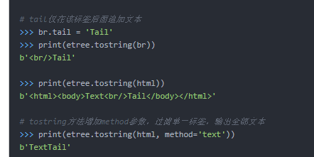

## lxml的使用


主要通过 etree 实现 操作, 可以 设置 tag , 增加节点, 爬虫主要是通过 `xpath` 来进行 文本的操作


Element 类  SubElement

```python

from lxml import etree 

root = etree.Element('root', attrib={'class', 'foo'})
root.attrib
{'class': 's'}
root.__class__
<class 'lxml.etree._Element'>
root
<Element root at 0x4761288>

# 添加子节点
etree.SubElement(root, 'child1')
```

#### tail 在 元素的尾部添加元素



#### xpath

```python

from lxml import etree

# etree Element 变为 xml 格式的 string
etree.tostring(root)

>>> child1 = etree.SubElement(root, 'child1')
>>> etree.tostring(root)
b'<root class="s"><child1/></root>'

>>> root.xpath('string()')  # 得到字符串
''
>>> root.xpath('//text()')  # 得到的是一个列表
[]
```


lxml提供如下方式输入文本：

```python

etree.fromstring():解析字符串
etree.HTML():解析HTML对象
etree.XML():解析XML对象
etree.parse():解析文件类型对象
```


#### 标签搜索


-   find() ： 返回第一个匹配的对象， 并且只能以相对路径 （'.//开头'）
-   findall() ：返回标签对象的列表， 使用相对路径
-   xpath()：返回标签的对象列表， 并且 xpath 可以使用相对和绝对路径


#### xpath 语法

```python
//input[start-with(@name, 'word')]  # name属性以 word 开头
//input[contains(@name, 'word')]  # name属性包含word
```

| 表达式   | 作用                   |
| -------- | ---------------------- |
| /        | 根节点选取             |
| //       | 在当前选择的文档中选取 |
| .        | 选取当前节点           |
| ..       | 选取当前节点的父节点   |
| @        | 选取属性               |
| nodename | 选取此节点的所有子节点 |

| 路径表达式      | 结果                                                         |
| --------------- | ------------------------------------------------------------ |
| bookstore       | 选取 bookstore 元素的所有子节点。                            |
| /bookstore      | 选取根元素 bookstore。注释：假如路径起始于正斜杠( / )，则此路径始终代表到某元素的绝对路径！ |
| bookstore/book  | 选取属于 bookstore 的子元素的所有 book 元素。                |
| //book          | 选取所有 book 子元素，而不管它们在文档中的位置。             |
| bookstore//book | 选择属于 bookstore 元素的后代的所有 book 元素，而不管它们位于 bookstore 之下的什么位置。 |
| //@lang         | 选取名为 lang 的所有属性。                                   |


| 路径表达式                         | 结果                                                         |
| ---------------------------------- | ------------------------------------------------------------ |
| /bookstore/book[1]                 | 选取属于 bookstore 子元素的第一个 book 元素。                |
| /bookstore/book[last()]            | 选取属于 bookstore 子元素的最后一个 book 元素。              |
| /bookstore/book[last()-1]          | 选取属于 bookstore 子元素的倒数第二个 book 元素。            |
| /bookstore/book[position()<3]      | 选取最前面的两个属于 bookstore 元素的子元素的 book 元素。    |
| //title[@lang]                     | 选取所有拥有名为 lang 的属性的 title 元素。                  |
| //title[@lang='eng']               | 选取所有 title 元素，且这些元素拥有值为 eng 的 lang 属性。   |
| /bookstore/book[price>35.00]       | 选取 bookstore 元素的所有 book 元素，且其中的 price 元素的值须大于 35.00。 |
| /bookstore/book[price>35.00]/title | 选取 bookstore 元素中的 book 元素的所有 title 元素，且其中的 price 元素的值须大于 35.00。 |

| 路径表达式   | 结果                              |
| ------------ | --------------------------------- |
| /bookstore/* | 选取 bookstore 元素的所有子元素。 |
| //*          | 选取文档中的所有元素。            |
| //title[@*]  | 选取所有带有属性的 title 元素。   |

在路径表达式中使用“|”运算符

| 路径表达式                       | 结果                                                         |
| -------------------------------- | ------------------------------------------------------------ |
| //book/title \| //book/price     | 选取 book 元素的所有 title 和 price 元素。                   |
| //title \| //price               | 选取文档中的所有 title 和 price 元素。                       |
| /bookstore/book/title \| //price | 选取属于 bookstore 元素的 book 元素的所有 title 元素，以及文档中所有的 price 元素。 |


