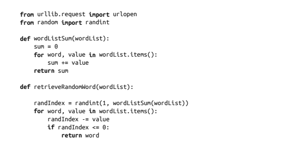
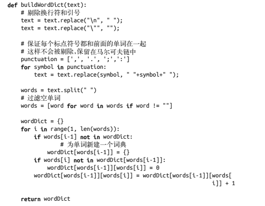
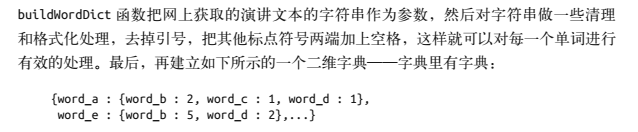
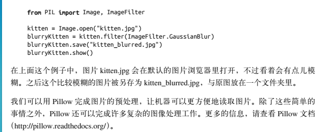
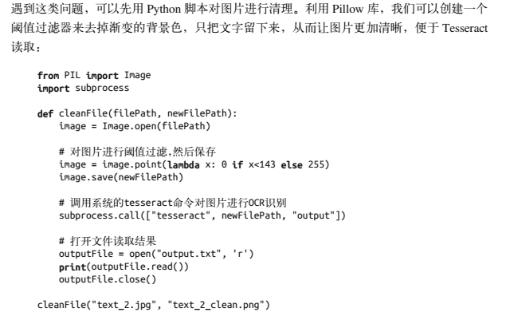
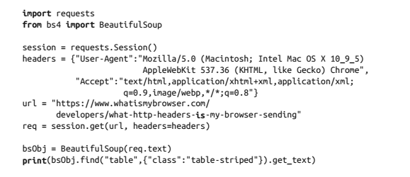
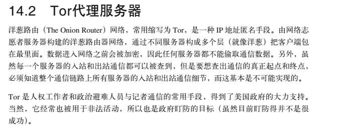
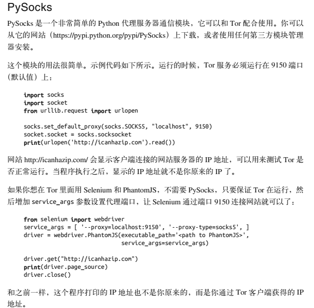

#### 马尔可夫模型-Pillow-Trsseract-伪装请求头-代理问题


```python

import string

p = string.punctuation  # 可以查看所有的标点符号
print(p)

str1.strip(p)  #去除字符创两端的标点符号
```


马尔可夫模型

一种常用语分析大量随机事件的模型

谷歌的 Page rank 算法就是基于 马尔可夫模型的









相当于将每个单词最为字典的键， 其 value 还是一个字典， 里面是整个训练集中该单词后面出现的单词的次数的统计几点， 更具出现的次数来判断该单词后面应该跟哪句话。


### pillow




### Tesseract


处理图片




### 关于伪装请求头


大多数网站的请求头， 通用部分

| 属性            | 内容                                                         |
| --------------- | ------------------------------------------------------------ |
| Host            | http://www.google.com/                                       |
| Connection      | keep-alive                                                   |
| Accept          | text/html, application/xjtml+xml，application/xml;q=0.9，image/webp，*/\*；q=0.8 |
| User-Agent      | Mozilla/5.0 (Windows NT 6.1; WOW64) AppleWebKit/537.36 (KHTML, like Gecko) Chrome/67.0.3396.99 Safari/537.36 |
| Referrer        | http://www.google.com/                                       |
| Accept-Encoding | gzip，deflate，sdch                                          |
| Accept-Language | en-US，en;q=0.8                                              |


在 urllib 包中， 默认会增加

| Accept-Encoding | identify          |
| --------------- | ----------------- |
| User-Agent      | Python-urllib/3.4 |


使用 Request包来进行 自定义请求头




### 代理服务器








