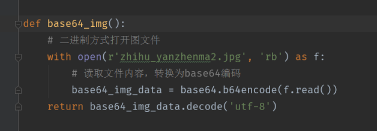

验证码识别

调用阿里云的图片验证码识别服务， 进行沿着码识别

[阿里云市场地址](https://market.aliyun.com/products/?sre=s0&keyword=%E5%9B%BE%E7%89%87%E9%AA%8C%E8%AF%81%E7%A0%81#ymk=%7B%22keywords%22:%22%E5%9B%BE%E7%89%87%E9%AA%8C%E8%AF%81%E7%A0%81%22,%22pageSize%22:10,%22pageIndex%22:1,%22categoryId%22:%22%22%7D)


```python

from base64 import b64encode

import ssl
from urllib.request import urlopen, Request
from urllib.parse import urlencode


host = 'http://txyzmsb.market.alicloudapi.com'
path = '/yzm'
method = 'POST'
appcode = 'Your Appcode'
querys = ''
bodys = {}
url = host + path

# base64 编码格式
v_pic = ''
# 图形验证码类型（n4：4位纯数字，n5：5位纯数字，n6:6位纯数字，e4：4位纯英文，e5：5位纯英文，e6：6位纯英文，ne4：4位英文数字，ne5：5位英文数字，ne6：6位英文数字），请准确填写，以免影响识别准确性。
v_type = 'e4'

with open('./static/images/bfpm.png', 'rb') as p:
    v_pic = b64encode(p.read()).decode('utf-8')

bodys['v_pic'] = v_pic
bodys['v_type'] = v_type
post_data = urlencode(bodys).encode('utf-8')
request = Request(url, post_data)
request.add_header('Authorization', 'APPCODE ' + appcode)
# 根据API的要求，定义相对应的Content-Type
request.add_header('Content-Type', 'application/x-www-form-urlencoded; charset=UTF-8')

# 全局取消 ssl 认证
# ssl._create_default_https_context = ssl._create_unverified_context
context = ssl._create_unverified_context()
response = urlopen(request, context=context)

content = response.read().decode('utf-8')
if content:
    print(content)
    
    
# 返回结果
{
    "msg":"查询成功!",
    "v_code":"bfpm",
    "errCode":0,
    "v_type":"e4"
}
```


base64编码可以封装成函数

