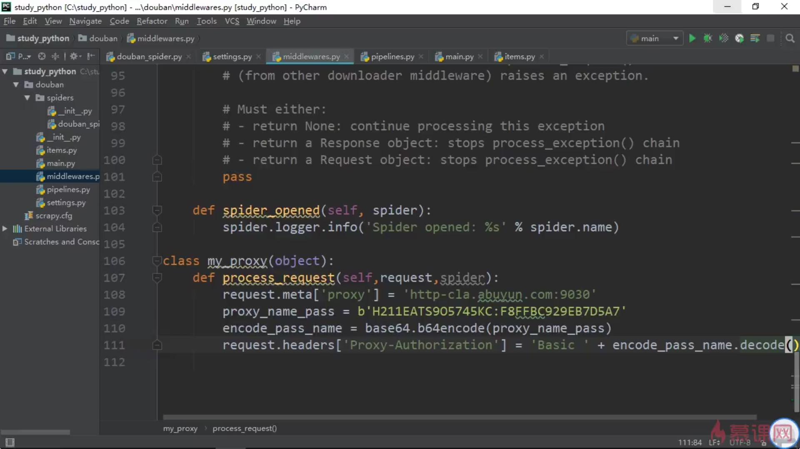

### HTTP代理

​	HTTP代理本质是一个web应用，它和普通的web 应用没设么区别，HTTP代理收到请求后，根据Header中Host字段的主机名和Get/POST请求地址综合判断目标主机，建立新的HTTP请求并转发请求数据，并将收到的响应数据转发给客户端。


​	简单说就是我们告诉代理我们需要设么， 让代理给我们去访问目标，给我们返回数据


##### python3 中  urllib 设置代理

```python

proxy_handler = urllib.request.ProxyHandler({'http':"http://121.121.12.12:80"})
opener = urllib.request.build_opener(proxy_handler)

r = opener.open('http://baidu.com')
print(r.read())
```


##### request 设置代理

​	requests是目前最优秀的HTTP库之一，也是我平时构造http请求时使用最多的库。它的API设计非常人性化，使用起来很容易上手。给requests设置代理很简单，只需要给proxies设置一个形如 `{'http': 'x.x.x.x:8080', 'https': 'x.x.x.x:8080'}` 的参数即可。其中http和https相互独立。

```python

response = requests.get('http://baidu.com/ip', proxies={'http':'123.123.12.12:80'})
print(response.json())
```

可以直接设置 session 的 proxies 的属性，省去每次请求都要带上 proxies 参数

```python

import requests

s = requests.session()
s.prixies = {'http': '123.0.0.2:80'}
print(s.get('http://www.baidu.com').json())
```

