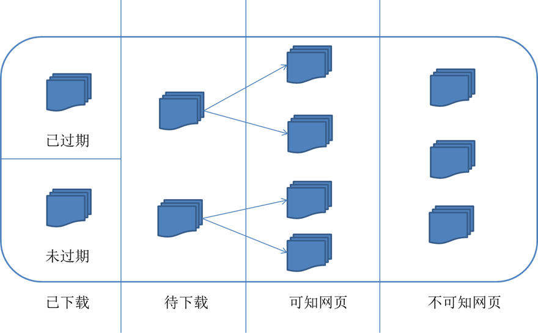
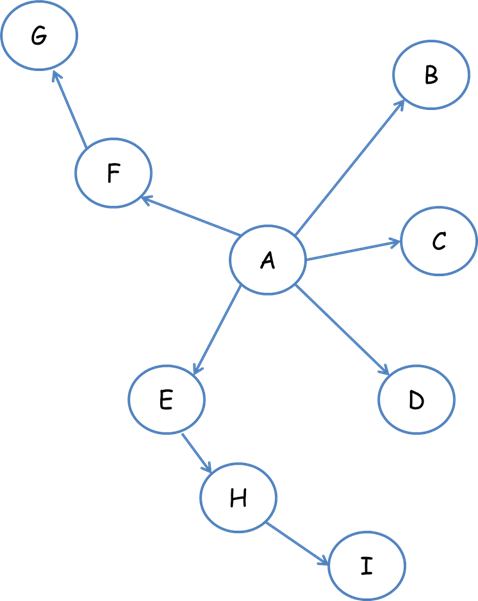

16-爬虫的原理

 	网络爬虫是捜索引擎抓取系统的重要组成部分。爬虫的主要目的是将互联网上的网页下载到本地形成一个或联网内容的镜像备份。这篇博客主要对爬虫以及抓取系统进行一个简单的概述。

通用的网络爬虫的框架示意图

网络爬虫的基本工作流程如下：

​    1.首先选取一部分精心挑选的种子URL；

​    2.将这些URL放入待抓取URL队列；

​    3.从待抓取URL队列中取出待抓取在URL，解析DNS，并且得到主机的ip，并将URL对应的网页下载下来，存储进已下载网页库中。此外，将这些URL放进已抓取URL队列。

​    4.分析已抓取URL队列中的URL，分析其中的其他URL，并且将URL放入待抓取URL队列，从而进入下一个循环

从爬虫的角度对互联网进行划分

​    对应的，可以将互联网的所有页面分为五个部分：

1.已下载未过期网页

​    2.已下载已过期网页：抓取到的网页实际上是互联网内容的一个镜像与备份，互联网是动态变化的，一部分互联网上的内容已经发生了变化，这时，这部分抓取到的网页就已经过期了。

​    3.待下载网页：也就是待抓取URL队列中的那些页面

​    4.可知网页：还没有抓取下来，也没有在待抓取URL队列中，但是可以通过对已抓取页面或者待抓取URL对应页面进行分析获取到的URL，认为是可知网页。

​    5.还有一部分网页，爬虫是无法直接抓取下载的。称为不可知网页。

#### 抓取策略

​    在爬虫系统中，待抓取URL队列是很重要的一部分。待抓取URL队列中的URL以什么样的顺序排列也是一个很重要的问题，因为这涉及到先抓取那个页面，后抓取哪个页面。而决定这些URL排列顺序的方法，叫做抓取策略。下面重点介绍几种常见的抓取策略：

1.深度优先遍历策略

深度优先遍历策略是指网络爬虫会从起始页开始，一个链接一个链接跟踪下去，处理完这条线路之后再转入下一个起始页，继续跟踪链接。我们以下面的图为例：

遍历的路径：A-F-G  E-H-I B C D

2.宽度优先遍历策略

​    宽度优先遍历策略的基本思路是，将新下载网页中发现的链接直接插入待抓取URL队列的末尾。也就是指网络爬虫会先抓取起始网页中链接的所有网页，然后再选择其中的一个链接网页，继续抓取在此网页中链接的所有网页。还是以上面的图为例：

​    遍历路径：A-B-C-D-E-F G H I

​    3.反向链接数策略

​    反向链接数是指一个网页被其他网页链接指向的数量。反向链接数表示的是一个网页的内容受到其他人的推荐的程度。因此，很多时候搜索引擎的抓取系统会使用这个指标来评价网页的重要程度，从而决定不同网页的抓取先后顺序。

​    在真实的网络环境中，由于广告链接、作弊链接的存在，反向链接数不能完全等他我那个也的重要程度。因此，搜索引擎往往考虑一些可靠的反向链接数。

​    4.Partial PageRank策略

​    Partial PageRank算法借鉴了PageRank算法的思想：对于已经下载的网页，连同待抓取URL队列中的URL，形成网页集合，计算每个页面的PageRank值，计算完之后，将待抓取URL队列中的URL按照PageRank值的大小排列，并按照该顺序抓取页面。

​    如果每次抓取一个页面，就重新计算PageRank值，一种折中方案是：每抓取K个页面后，重新计算一次PageRank值。但是这种情况还会有一个问题：对于已经下载下来的页面中分析出的链接，也就是我们之前提到的未知网页那一部分，暂时是没有PageRank值的。为了解决这个问题，会给这些页面一个临时的PageRank值：将这个网页所有入链传递进来的PageRank值进行汇总，这样就形成了该未知页面的PageRank值，从而参与排序。下面举例说明：

​    5.OPIC策略策略

​    该算法实际上也是对页面进行一个重要性打分。在算法开始前，给所有页面一个相同的初始现金（cash）。当下载了某个页面P之后，将P的现金分摊给所有从P中分析出的链接，并且将P的现金清空。对于待抓取URL队列中的所有页面按照现金数进行排序。

​    6.大站优先策略

​    对于待抓取URL队列中的所有网页，根据所属的网站进行分类。对于待下载页面数多的网站，优先下载。这个策略也因此叫做大站优先策略。 

